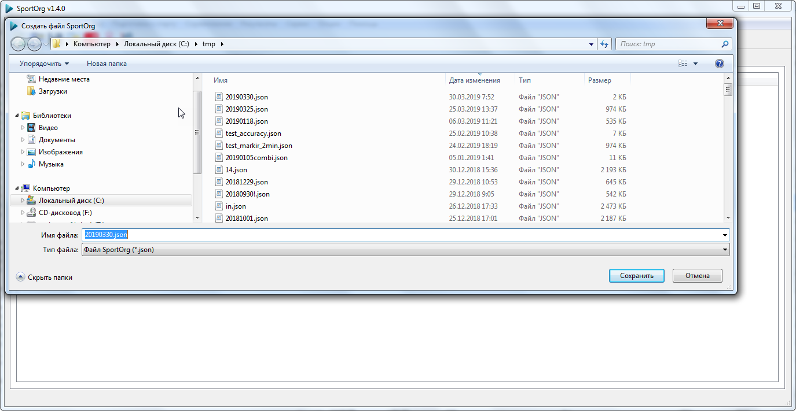

#Создание нового события

##Формат файла SportOrg
В программе SportOrg каждое соревнование сохраняется в отдельном файле, имеющем расширение JSON.
Каждый файл содержит всю информацию об участниках, коллективах, дистанциях, а также настройки. 
Вы можете передавать файлы своим коллегам. 

Не следует работать в нескольких экземплярах программы SportOrg с одним и тем же файлом - это может привести к потере части данных. 

Формат файла SportOrg меняется от версии к версии, но мы гарантируем обратныю совместимость - все Ваши старые файлы будут открываться в новых версиях, но не наоборот.
Если у Вас воникают проблемы с открытием файлов, убедитесь, что установлена последняя версия приложения.

##Создание нового файла
Для создания нового файла выберете пункт меню Файл - Новый (Ctrl+N).

Если Вы работаете с одним файлом и хотите создать новый, не забудьте сохранить изменения в текущем файле.

Укажите имя файла и директрию для сохранения, по умолчанию имя файла формируется из текущей даты.

После создания нового файла его имя будет показано в верхней части окна.

##Изменение данных о соревновании
Для изменения данных о соревновании выберете пункт меню Файл - Свойства соревнования

Введите данные о соревнованиях в появившемся диалоге. [Подробнее...](../../ui/dialogs/dialog_event_properties.md)

