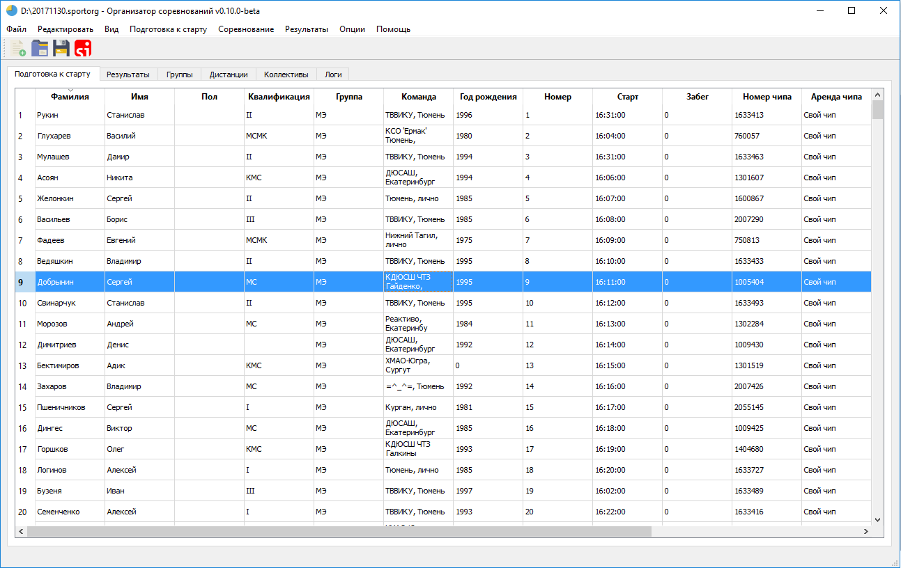
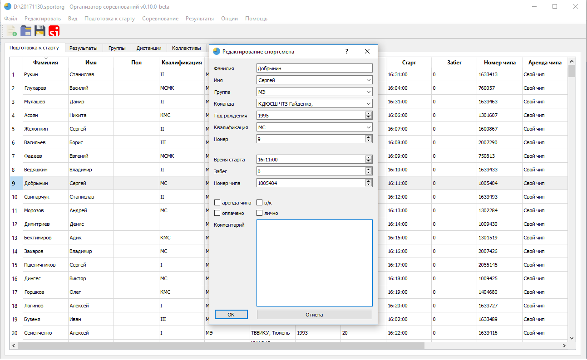
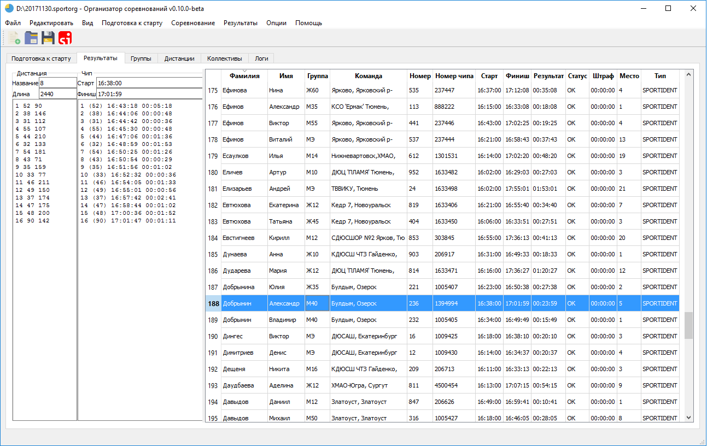

# SportOrg

___

Документация по состоянию на 12 мая 2019г. 

___

## Загрузить

[Скачать v1.4.0](https://vk.cc/8VRKq2)

## Установка

1. Загрузите установщик SportOrg,
1. Установите программу,
1. Запустите программу SportOrg.exe.

## Проведение соревнований
### Предварительная подготовка к старту

[Создание нового события](event_management/preparation/new_event.md)

[Импорт предварительных заявок](user-guide/import_entries.md)

[Импорт дистанций](user-guide/import_courses.md)

[Присвоение дистанций для групп](user-guide/group_course.md)

[Присвоение коридоров для групп](user-guide/group_corridor.md)

Предстартовая подготовка
* [Вставка резервных участников](user-guide/start_reserve.md)
* [Жеребьевка](user-guide/start_draw.md)
* [Присвоение времени старта](user-guide/start_time.md)
* [Присвоение номеров](user-guide/start_bib.md)
    
Отчеты и протоколы
* [Протокол старта](user-guide/start_protocol_list.md)
* [Шахматка](user-guide/start_protocol_times.md)
* [Командные выписки](user-guide/start_protocol_team.md)
* [Номера](user-guide/start_protocol_bibs.md)
* [Справка комиссии по допуску](user-guide/start_protocol_statistics.md)

### Предстартовая работа в день соревнований

Присвоение чипов

Дозаявка

[Смещение времени старта](ui/dialogs/dialog_time_offset.md)

[Настройка электронной отметки](user-guide/sportident.md)

[Настройка печати распечаток](user-guide/printout_punches.md)

[Настройка online](user-guide/online_orgeo.md)

[Настройка командной работы](user-guide/teamwork.md)

### Прием финиша
[Ручной финиш](user-guide/finish_manual.md)

Считывание чипов
    Работа с неизвестными чипами
    
Ручное восстановление/снятие

[Корректировка времени финиша](user-guide/finish_modify.md)

Отслеживание нефинишировавших

### Работа после финиша участников

Настройка выполнения разрядов

Формирование протоколов
* протокол результатов html
* сплиты
* официальные протоколы
* сумма многодневных соревнований

### Прочее

[Многодневные соревнования](user-guide/multiday.md)

Эстафеты

Рогейн

[Проверка отметки в различных дисциплинах](user-guide/course.md)

[Лабиринт](user-guide/maze.md)

Расширенная конфигурация
* Словарь имен
* Словарь регионов

## Возможные проблемы

[FAQ](faq/index.md)

[Группа VK](https://vk.com/sportorgio)

## Для разработчиков

[GitHub](https://sportorg.github.io/pysport/)
