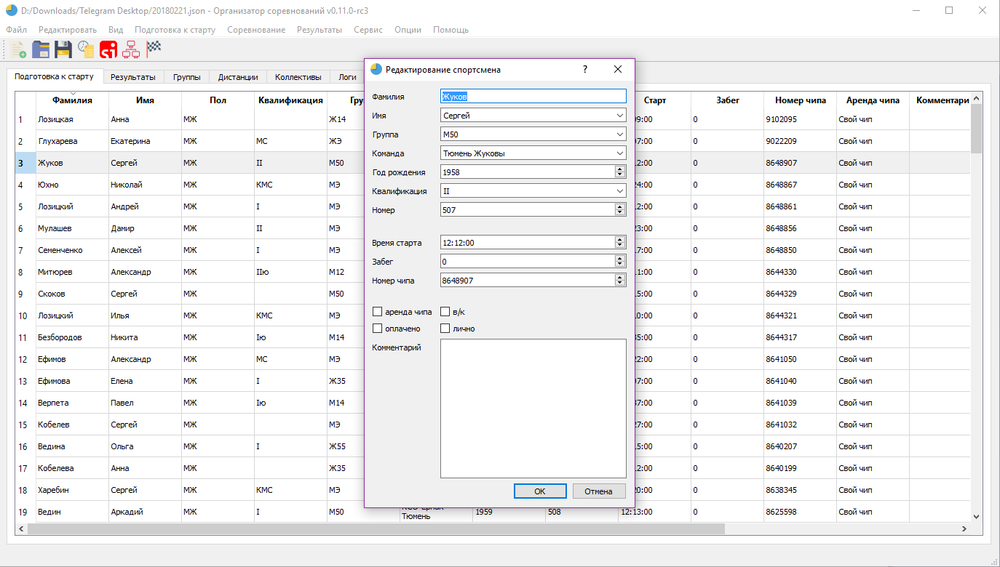
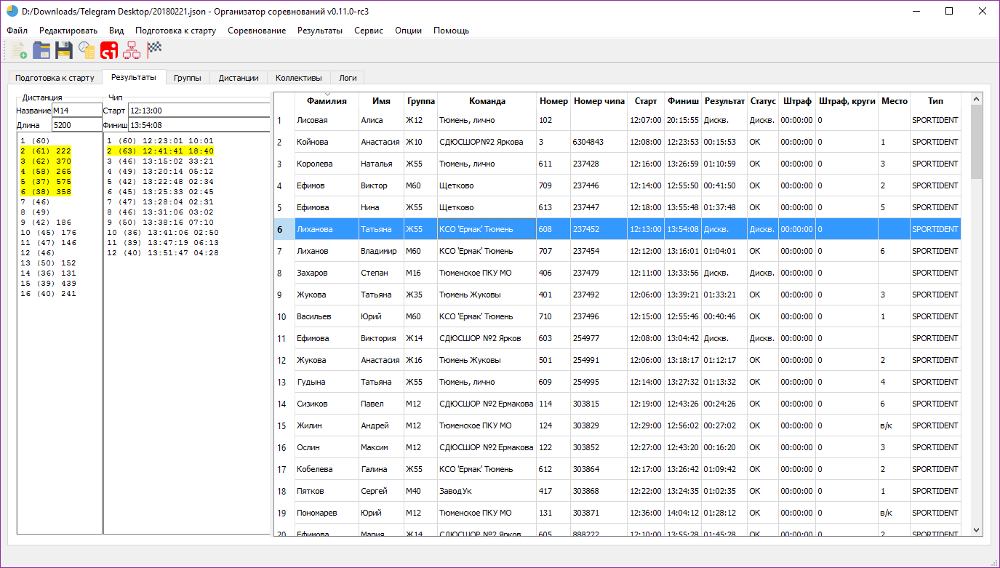
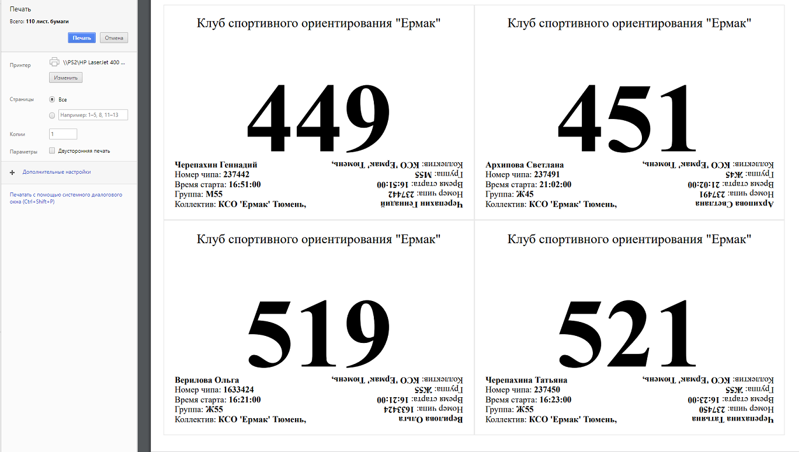

# SportOrg

___

## Загрузить

[Скачать v0.11.0-rc2](http://goo.gl/N5pZLH)

[Документация c примерами](//sportorg.o-ural.ru/data/docs180125.zip)

## Установка

1. Загрузите программу SportOrg,
1. распакуйте архив,
1. запустите программу SportOrg.exe.

## Возможные проблемы

[FAQ](faq/index.md)

## Для разработчиков

[GitHub](https://sportorg.github.io/pysport/)
