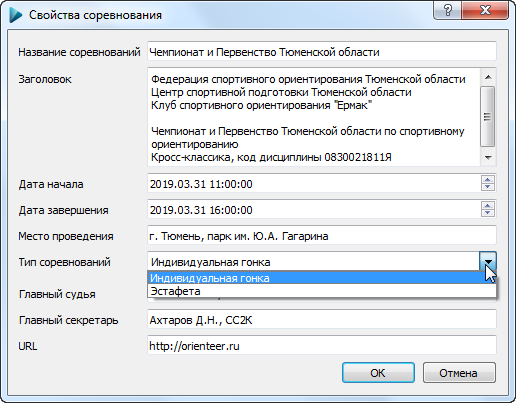

#Диалог свойств сореванования

Данный диалог позволяет редактировать свойства соревнования.
Все поля опциональные для заполнения, данные можно внести после проведения соревнований во время формирования протоколов результатов.
При [многодневном соревановании](TODO) эти свойства задаются для каждого дня отдельно.

Основные параметры:

##Название сореванований

Краткое название соревнований, печатется на номерах и в заголовке официальных протоколов

##Заголовок

В данное поле следует ввести многострочный заголовок соревнований. Обычно здесь отображается информация об организаторах, код дисциплины и т.д.
Ограничение на количество строк отсутствует, но обычно не делают заголовок более 10 строк.

##Дата начала

Дата и время старта. Отображается в верхней части окна приложения, а также во всех протоколах.
Время старта влияет на обработку чипов SPORTident SI-Card5, которые сохраняют отметки в 12-часовом формате.
По умолчанию значению этого поля присвоено время создания файла соревнований. 

##Дата завершения

Дата завершения старта. 

##Место проведения

Название места, в котором проводятся соревнования. Отображается в протоколах. 

##Тип соревнований

Выберете основной тип соревнований - индивидуальная гонка либо эстафета. 
Для [эстафетных соревнований](TODO) предусмотрено автоматическое объединение участников в команды, протоколы формируются по-другому.

##Главный судья

Информация о главном судье соревнований. Вы можете указать здесь категорию судьи и регион, который он представляет.

##Главный секретарь

Информация о главном секретаре соревнований. Вы можете указать здесь категорию судьи и регион, который он представляет.

##URL

Веб-адрес, который будет отображаться в протоколах. Можете указать адрес Вашего сайта, либо ссылку на [онлайн-трансляцию](TODO).
