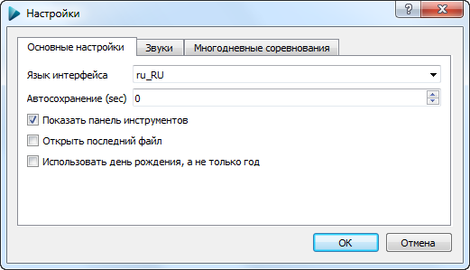
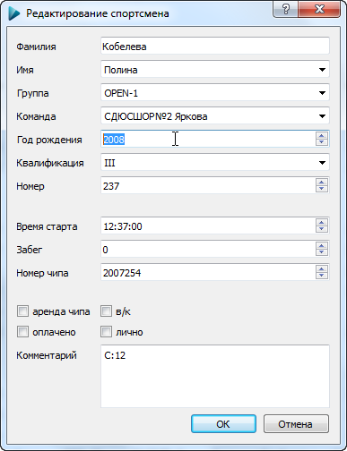
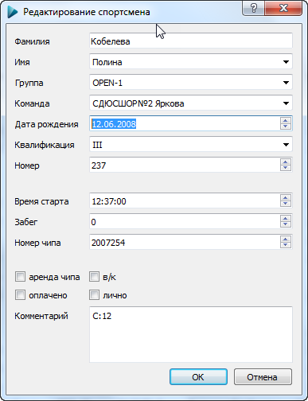
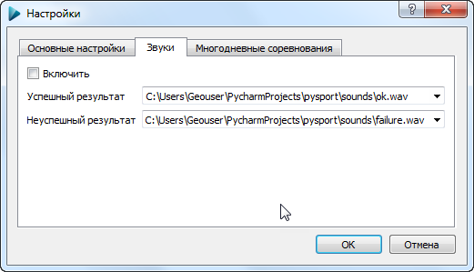

#Диалог настроек

Данный диалог позволяет редактировать настройки соревнований. 
При [многодневном соревановании](TODO) настройки общие для всех дней.

##Основные настройки

###Язык интерфейса
В данный момент предусмотрены 2 языка интерфейса - Русский и Английский. Для добавления нового языка обратитьесь к Разработчикам.
Изменения вступят в силу после перезапуска приложения.

###Автосохранение
Вы можете указать время авотосохранения файла соревнований (в секундах). Рекомендуется использовать автосохранение с настйрокой 30-60 секунд во время ответственных стартов - даже во время случайного закрытия приложения или отключения питания компьютера большинство изменений будут сохранены. 
Нежелательно использовать автосохранение чаще 1 раза в 10 секунд - при этом возможно снижение производительности приложения при участии в соревнованиях более 100 участников.
При задании 0 автосохранение будет не будет применяться.

###Показать панель инструментов
Отображение или скрытие [Панели инструментов](TODO)
Изменения вступят в силу после перезапуска приложения.

###Открыть последний файл
При активации этой опции после повторного запуска приложения автоматически будет открыт поледний использовавшийся файл.

###Использовать день рождения, а не только год
При применении данной настройки при редактировании спортсмена можно указать не только год рождения, но и дату. 
Независимо от отображения, в файле соревнований всегда сохраняется именно дата рождения, а не только год.

Отключенная опция / Включенная опция:

##Настройка звуков

Вы можете задать звуки, которые будут воспроизводиться при считывании чипов. Если участник успешно прошел дистанцию, воспроизводится звуковой файл "Успешный результат". Если у участника имеются какие-то проблемы с отметкой (пропущенный КП, недостаточно КП на дистанции по выбору), будет воспроизведет звуковой файл "Неуспешный результат".
Поддерживаемый формат звуковых файлов - WAV. 

Для активации функционала выберете звуковые файлы для воспроизведения и отметьте галочку "Включить".

##Многодневные соревнования

Принцип работы SportOrg такой, что пользователь работает всегда только с одним определенным днем/стартом. Редактирование участников, прием финиша происходят только в текущем дне. 
Все данные участников, финиш, сплиты, большинство настроек хранятся внутри соревновательного дня. 

Для переключения между соревновательными днями используется выпадающий список, каждая строчка которого соответствует отдельному дню, показывается время старта для этого дня, взятое из его настроек.
Для перехода на другой соревновательный день просто выберете из списка нужное значение.

### Основные операции с днями

* `Новый` Создание нового соревновательного дня. День помещается в конец списка.
* `Копировать` Копирование текущего соревновательного дня в новый. Новый день помещается в конец списка.
* `Сдвинуть вверх` Текущий соревновательный день перемещается выше по списку.
* `Сдвинуть вниз` Текущий соревновательный день перемещается ниже по списку.
* `Удалить` Текущий соревновательный день полностью удаляется. Будьте внимательны, удаление производится безвозвратно! Рекомендуем сделать резервную копию базы перед удалением.
