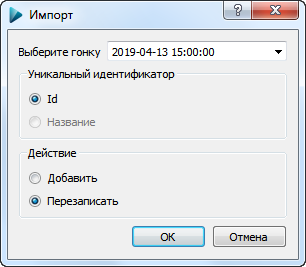

#Диалог импорта данных из файла SportOrg

Данный диалог позволяет уточнить, как производить импорт данных из существующего файла SportOrg. 
Производится импорт всех объектов - участников, групп, результатов, команд, дистанций.

Вы можете выбрать необходимый день, если файл содержит многодневные соревнования.

Поддерживаются 2 типа действий при импорте:
 - ###Добавление
 Данные добавляются в текущий файл
 
 - ###Перезапись
 Если объект уже существует, он будет перезаписан. В текущей версии используются [Идентификаторы объектов](TODO), чтобы определить уникальность.
 Идентификаторы генерируются при создании новых объектов, они будут совпадать, только если Вы сохранили базу соревнований под другим именем.
 
 Внимание! После импорта необходимо проверить номера участников и номера чипов на дубликаты!