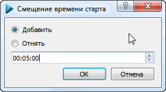

#Смещение времени старта

Данный диалог используется для смещения времени старта.

Нередки ситуации, когда старт дается не вовремя - ле или наоборот дается раньше.

Есть способ оперативно изменить время старта для всех участников либо для участников определенной группы.

Необходимо задать время смещения в формате ЧЧ:ММ:CC, а также указать, добавить это значение ко времени старта или отнять.

Используя Фильтрацию, можно сместить время старта только для одной группы.

 