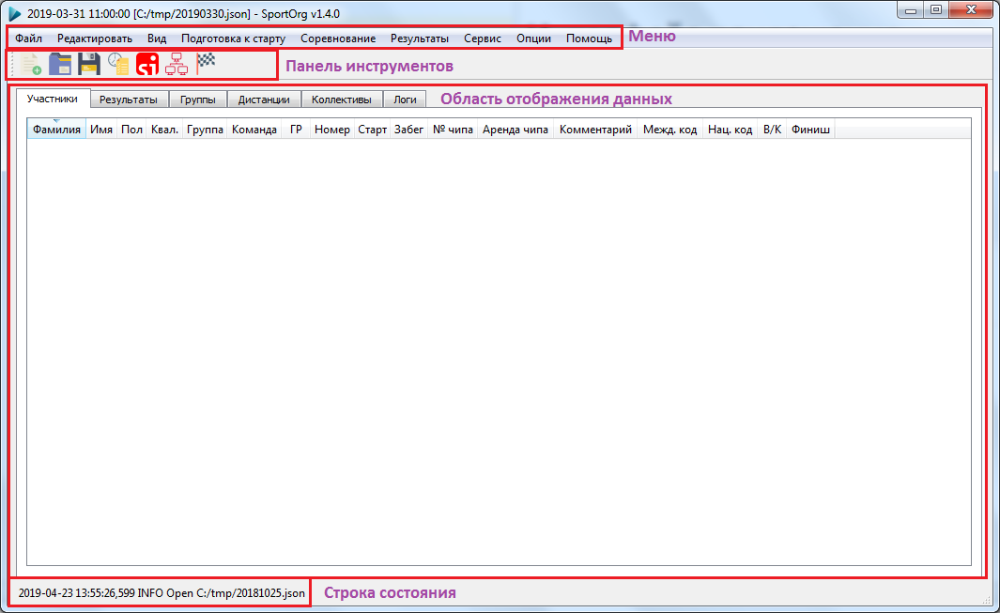
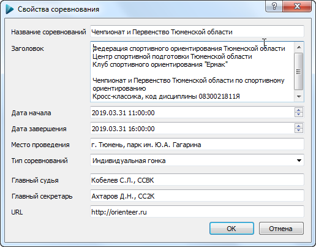

#Интерфейс приложения

При запуске приложения отображается графическое окно.
Интерфейс приложения состоит из следующих компонентов: 
- `Меню`. Используется для вызова команд и диалогов.
- `Панель инструментов`. Позволяет быстро выполнить определеные действия.
- `Область отображния данных`. Предстаявлет собой набор вкладок, представляющих информацию об объектах базы данных.
- `Строка состояния`. Отображает последние сообщения приложения. 

#Диалоги 

Многие настройки и функции редактирования объектов реализованы в виде всплывающих окон.
Большинство окон являются модальными, то есть для продолжения работы с основным окном приложения необходимо закрыть окно диалога.

Для закрытия дилога использйте красный крест в правом верхнем углу либо кнопки `ОК`, `Отмена`в нижней части диалога.

#Закрытие приложения

Для выхода из приложения используйте пункт меню [Файл -> Выход](TODO) либо красный крест в правом верхнем углу приложения.

