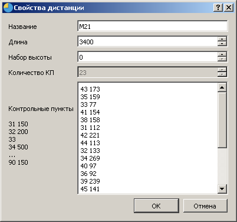
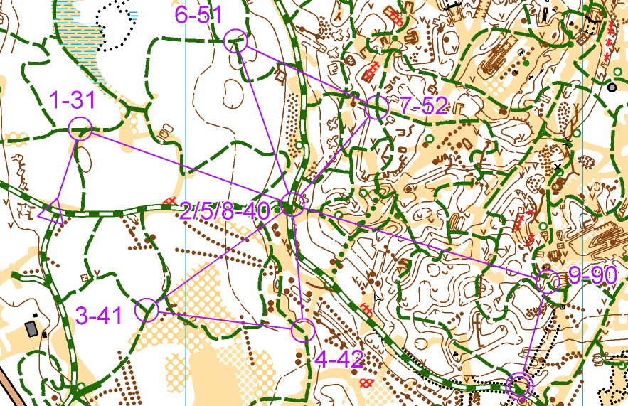

# Проверка отметки

___

На данный момент реализована проверка отметки для различных дисциплин.

По умолчанию порядок прохождения берется через группу участника, из свойств соответствующей дистанции. 

При различных вариантах рассева предусмотрена прямая связь между участником и дистанцией. Это полезно в эстафетах, эстафетах одного участника (OMR), при рассевах типа "бабочка". 
Если номер участника совпадает с названием дистанции, то именно она используется для проверки отметки. Для эстафет также проверяются названия, состоящие из номера команды и номера участника, разделенных точкой 
    
    дистанция "12.1" соответствует участнику с номером 1012
___
###Важное замечание!
Старайтесь не использовать без необходимости названия дистанций "1", "2", "3" и т.д. - это может привести к неправильной проверке отметки участников с номерами 1, 2, 3 и т.д.
___

## ***Заданное направление***

В параметрах дистанции задаются коды КП, которые нужно пройти в заданном порядке. Опционально можно указывать длину перегона в метрах.
Пример дистанции из 4 КП:

    31
    32
    33
    34

или

    31 1992
    32 334
    33 533
    34 121
    
Пример окна редактирования

## ***Заданное направление с бабочкой (небольшой рассев)***

Бабочка `31-40-41-42-40-51-52-40-90` либо  `31-40-51-52-40-41-42-40-90`
Можно присвоить каждому участнику свою дистанцию, либо ввести в таком формате (Тут возможно нарушение порядка, например, `31-40-41-52-40-52-41-40-90`, но оно обычно не несет преимущества)

    31
    40
    *(41,51)
    *(42,52)
    40
    *(41,51)
    *(42,52)
    40
    90

## ***Выбор***

Введены 2 понятия – “уникальный КП”  и “произвольный КП”
Для классической дистанции по выбору из 4 КП параметры дистанции имеют следующий вид:

    *
    *
    *
    *

Если нужно, чтобы 1 КП обязательно был №31:

    31
    *
    *
    *

Если нужно, чтобы последний КП обязательно был №90

    *
    *
    *
    90

Если нужно, чтобы был задан список допустимых КП 31-45

    *(31,32,33,34,35,36,37,38,39,40,41,42,43,44,45)
    *(31,32,33,34,35,36,37,38,39,40,41,42,43,44,45)
    *(31,32,33,34,35,36,37,38,39,40,41,42,43,44,45)
    *(31,32,33,34,35,36,37,38,39,40,41,42,43,44,45)

Первый КП - №31, далее произвольные 2 КП, уникальные на дистанции, последний КП 90

    *31
    *(31,32,33,34,35,36,37,38,39,40,41,42,43,44,45)
    *(31,32,33,34,35,36,37,38,39,40,41,42,43,44,45)
    *90
    
Гибридная дистанция (реальный пример).
19 КП по выбору, №33 необходимо взять пятым, №34 шестым, между ними микродистанция на обратной
стороне карты (8КП, заданное направление). Последний КП № 90.

    *(31,32,33,34,35,36,37,38,39,40,41,42,43,44,45,46,47,48,49) 
    *(31,32,33,34,35,36,37,38,39,40,41,42,43,44,45,46,47,48,49) 
    *(31,32,33,34,35,36,37,38,39,40,41,42,43,44,45,46,47,48,49) 
    *(31,32,33,34,35,36,37,38,39,40,41,42,43,44,45,46,47,48,49) 
    33 
    52 
    60 
    62 
    54 
    61 
    56 
    57 
    58 
    34 
    *(31,32,33,34,35,36,37,38,39,40,41,42,43,44,45,46,47,48,49) 
    *(31,32,33,34,35,36,37,38,39,40,41,42,43,44,45,46,47,48,49) 
    *(31,32,33,34,35,36,37,38,39,40,41,42,43,44,45,46,47,48,49) 
    *(31,32,33,34,35,36,37,38,39,40,41,42,43,44,45,46,47,48,49) 
    *(31,32,33,34,35,36,37,38,39,40,41,42,43,44,45,46,47,48,49) 
    *(31,32,33,34,35,36,37,38,39,40,41,42,43,44,45,46,47,48,49) 
    *(31,32,33,34,35,36,37,38,39,40,41,42,43,44,45,46,47,48,49) 
    *(31,32,33,34,35,36,37,38,39,40,41,42,43,44,45,46,47,48,49) 
    *(31,32,33,34,35,36,37,38,39,40,41,42,43,44,45,46,47,48,49) 
    *(31,32,33,34,35,36,37,38,39,40,41,42,43,44,45,46,47,48,49) 
    *(31,32,33,34,35,36,37,38,39,40,41,42,43,44,45,46,47,48,49) 
    *(31,32,33,34,35,36,37,38,39,40,41,42,43,44,45,46,47,48,49) 
    90 

## ***Маркировка без прокола***

Вариант  А =  заданное направление

    31
    32
    33
    34

Вариант  Г с ТПР. Порядок прохождения контролируется списком КП в скобках, а штраф начисляется по 1 КП – это правильный вариант.

    31(31,32,33)
    42(41,42,43)
    51(51,52,53)
    63(61,62,63)

Вариант  Д (2017, Снятие при отсутствии отметки истинного КП) – аналогично заданному направлению, штраф начисляется за лишние отметки.

    31
    32
    33
    34

Вариант  Д (модификация 2018, ДА-НЕТ). Порядок прохождения контролируется списком КП в скобках, а штраф начисляется по 1 КП – это правильный вариант.

    31(31,32)
    42(41,42)
    51(51,52)
    61(61,62)

## Проверка отметки по всем дистанциям

В параметрах группы нужно выбрать пункт "Любая дистанция".
Тогда отметка будет "Ok", если хотя бы одна дистанция совпала с отметками участника