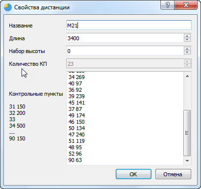

# Проверка отметки

___

На данный момент реализована проверка отметки для различных дисциплин.

## ***Заданное направление***

В параметрах дистанции задаются коды КП, которые нужно пройти в заданном порядке. Опционально можно указывать длину перегона в метрах.
Пример дистанции из 4 КП:

    31
    32
    33
    34

или

    31 1992
    32 334
    33 533
    34 121
    
Пример окна редактирования

## ***Заданное направление с бабочкой (небольшой рассев)***

Бабочка `31-40-41-42-40-51-52-40-90` либо  `31-40-51-52-40-41-42-40-90`
Можно присвоить каждому участнику свою дистанцию, либо ввести в таком формате (Тут возможно нарушение порядка, например, `31-40-41-52-40-52-41-40-90`, но оно обычно не несет преимущества)

    31
    40
    *(41,51)
    *(42,52)
    40
    *(41,51)
    *(42,52)
    40
    90

## ***Выбор***

Введены 2 понятия – “уникальный КП”  и “произвольный КП”
Для классической дистанции по выбору из 4 КП параметры дистанции имеют следующий вид:

    *
    *
    *
    *

Если нужно, чтобы 1 КП обязательно был №31:

    31
    *
    *
    *

Если нужно, чтобы последний КП обязательно был №90

    *
    *
    *
    90

Если нужно, чтобы был задан список допустимых КП 31-45

    *(31,32,33,34,35,36,37,38,39,40,41,42,43,44,45)
    *(31,32,33,34,35,36,37,38,39,40,41,42,43,44,45)
    *(31,32,33,34,35,36,37,38,39,40,41,42,43,44,45)
    *(31,32,33,34,35,36,37,38,39,40,41,42,43,44,45)

Первый КП - №31, далее произвольные 2 КП, уникальные на дистанции, последний КП 90

    *31
    *(31,32,33,34,35,36,37,38,39,40,41,42,43,44,45)
    *(31,32,33,34,35,36,37,38,39,40,41,42,43,44,45)
    *90

## ***Маркировка без прокола***

Вариант  А =  заданное направление

    31
    32
    33
    34

Вариант  Г с ТПР. Порядок прохождения контролируется списком КП в скобках, а штраф начисляется по 1 КП – это правильный вариант.

    31(31,32,33)
    42(41,42,43)
    51(51,52,53)
    63(61,62,63)

Вариант  Д (2017, Снятие при отсутствии отметки истинного КП) – аналогично заданному направлению, штраф начисляется за лишние отметки.

    31
    32
    33
    34

Вариант  Д (модификация 2018, ДА-НЕТ). Порядок прохождения контролируется списком КП в скобках, а штраф начисляется по 1 КП – это правильный вариант.

    31(31,32)
    42(41,42)
    51(51,52)
    61(61,62)
