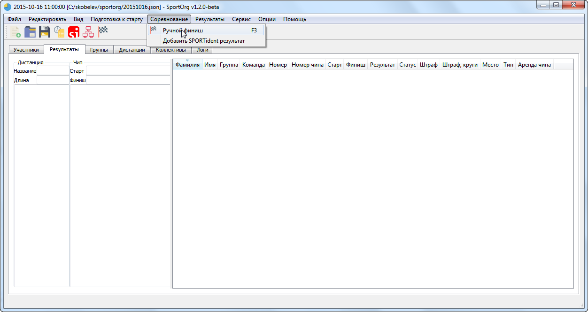
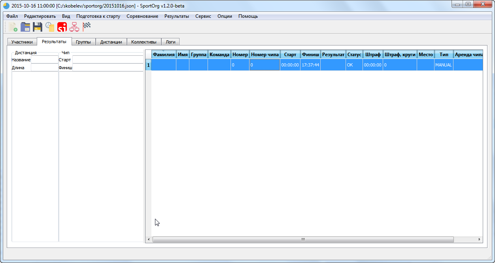
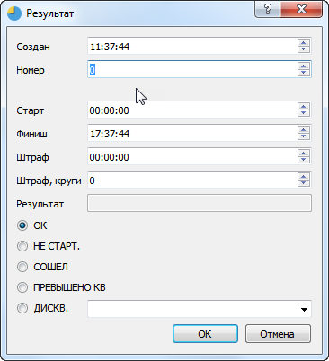
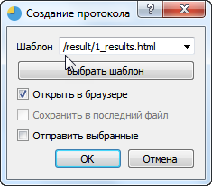
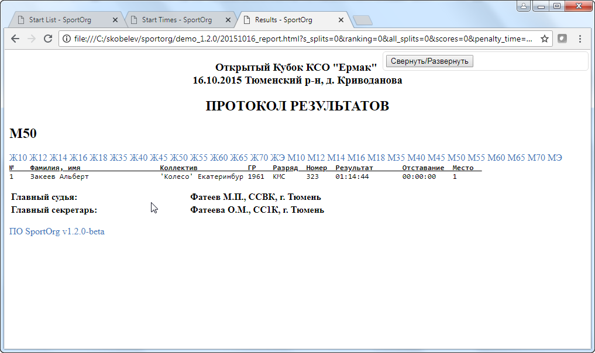

# Финиш

___

## Соревнование – Ручной финиш

Для приема финиша в ручном режиме необходимо использовать опцию меню «Соревнование – Ручной финиш», либо горячую клавишу F3. На закладке «Результаты» появится новая строка. Временем финиша будет системное время, взятое с компьютера, на котором запущена программа. Тщательно проверьте, что часы
синхронизированы!

Для редактирования результата необходимо дважды кликнуть мышью по строке либо перейти на нее и нажать Enter.

В появившемся окне можно изменить значения записи – время финиша и старта, номер участника, статус дисквалификации. При изменении номера указывается найденный по этому номеру
спортсмен.

## Результаты – создать протокол

Протокол результатов формируется по предустановленным шаблонам.

В дальнейшем разработчики SportOrg подготовят различные шаблоны для генерации результатов с различными настройками.

