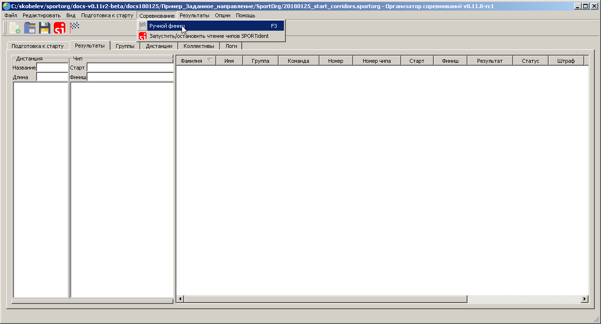
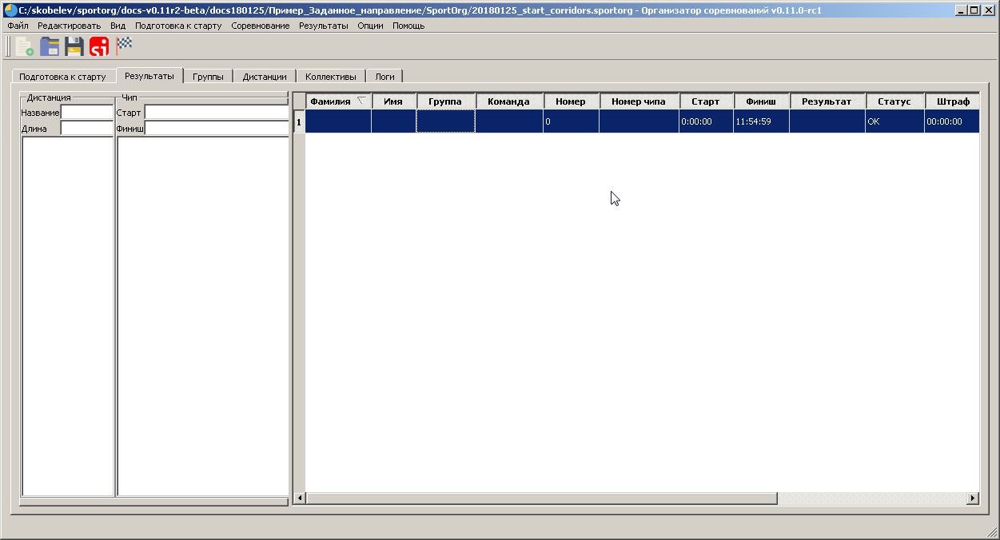

# Соревнование – Ручной финиш

Для приема финиша в ручном режиме необходимо использовать опцию меню «Соревнование – Ручной финиш», либо горячую клавишу F3. На закладке «Результаты» появится новая строка. Временем финиша будет системное время, взятое с компьютера, на котором запущена программа. Тщательно проверьте, что часы
синхронизированы!

