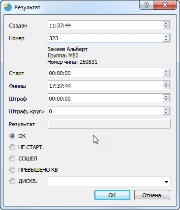
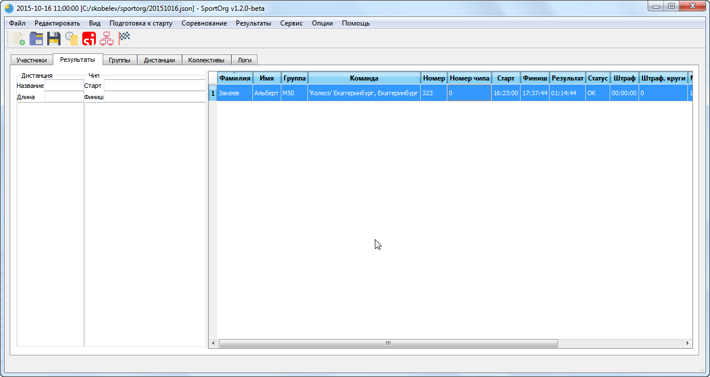

# Результат - редактирование

Для редактирования результата необходимо дважды кликнуть мышью по строке либо перейти на нее и нажать Enter.

В появившемся окне можно изменить значения записи – время финиша и старта, номер участника, статус дисквалификации. При изменении номера указывается найденный по этому номеру
спортсмен.

