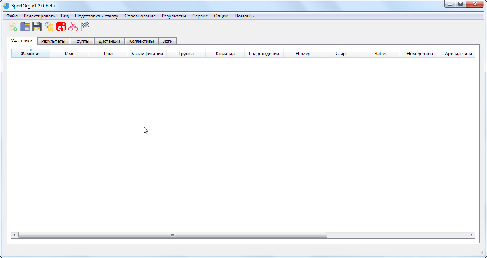
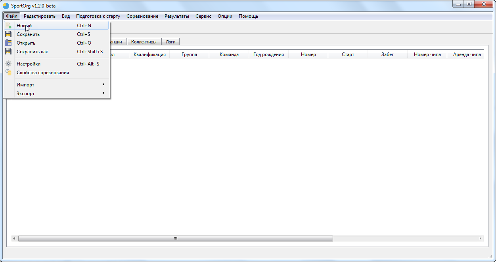
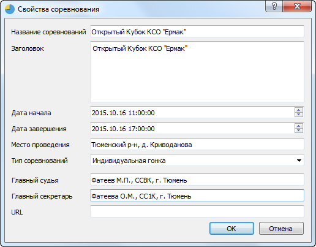

# Начало работы

___

Запуск приложения.

Для этого необходимо распаковать архив и запустить файл SportOrg.exe. Может потребоваться установка Visual C++ Redistributable.

Системные требования: Windows 7 32/64 и более новые версии Windows.

Создание нового файла

Задание информации о соревнованиях

