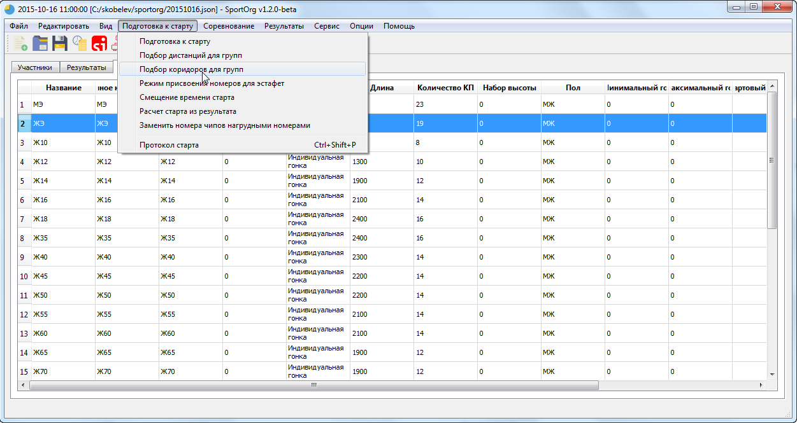
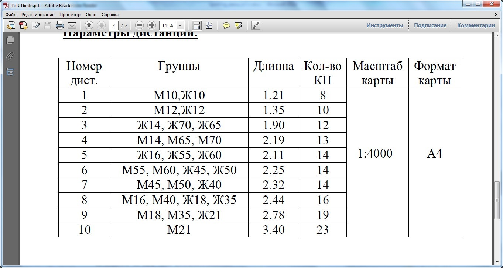

## Присвоение коридоров для групп

В соревнованиях с интервальным стартом организуется несколько стартовых коридоров, в которых по очереди стартуют несколько групп. 
Для каждой группы можно указать, в каком коридоре она стартует, а также порядок старта группы в коридоре.
В дальнейшем эта информация будет использована при формировании протокола старта и шахматки.

Коридоры можно создать автоматически, используя пункт меню **Подбор коридоров для групп** - каждая дистанция будет выделена в отдельный коридор. Порядок старта внутри коридора можно будет указать дополнительно.
Коридоры нумеруются по порядку расположния дистанций в списке на вкладке **Дистанции**. 
Предварительно убедитесь, что для всех групп присвоены дистанции.

Также номера коридоров можно присвоить вручную.
Рекомендуется согласовать коридоры и порядок в коридоре со службой дистанции, чтобы они соответствовали положению о соревнованиях.

