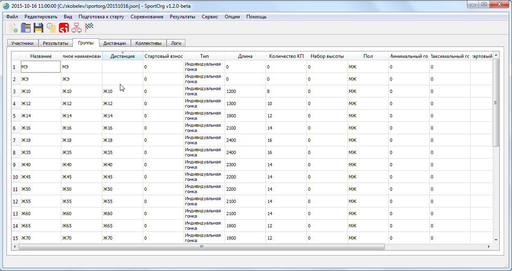
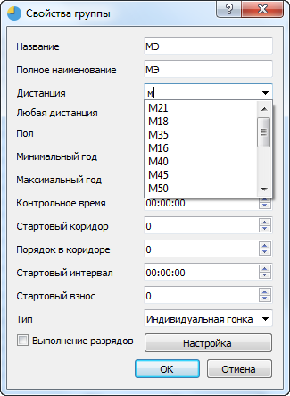

## Присвоение дистанций для групп

Для каждой группы должна быть задана дистанция. 
Из ее параметров берется длина, количество КП, контрольное время.

В SportOrg есть опция подбора дистанций по имени – если имя дистанции содержит в себе имя группы, то они связываются. Например, группа “Ж12” свяжется с дистанцией “М12,Ж12”

Из примера видно, что для МЭ и ЖЭ нужно указать дистанции вручную

Для редактирования группы 2 раза кликаем по ней или нажимаем Enter после выделения

Во всех выпадающих списках применяется фильтрация по введенному значению

