# Импорт данных

___

## Импортирование данных заявки (сделана на сайте orgeo.ru)

Текущая версия по умолчанию поддерживает формат «CSV Winorient с представителями».

Формат полей:

* Группа
* ФИО
* Коллектив
* Представитель
* Разряд
    * 0 = б/р
    * 1 = Iю
    * 2 = IIю
    * 3 = IIIю
    * 4 = I
    * 5 = II
    * 6 = III
    * 7 = КМС
    * 8 = МС
    * 9 = МСМК
    * 10 = ЗМС  // В программе будет указано МСМК
* Номер
* Год рождения
* Номер чипа
* Комментарий

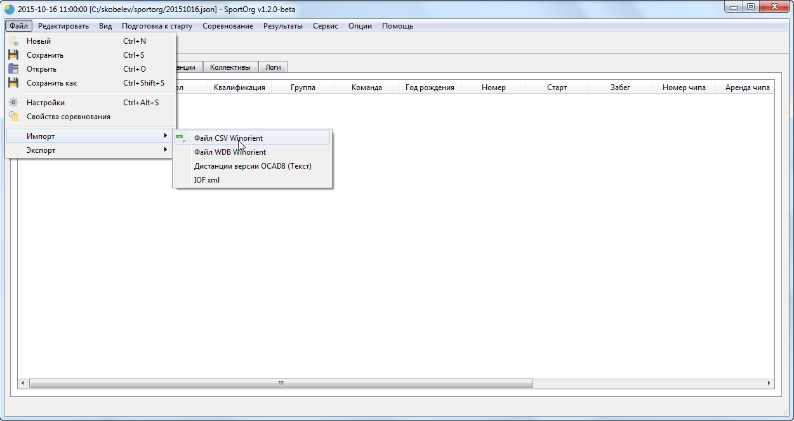
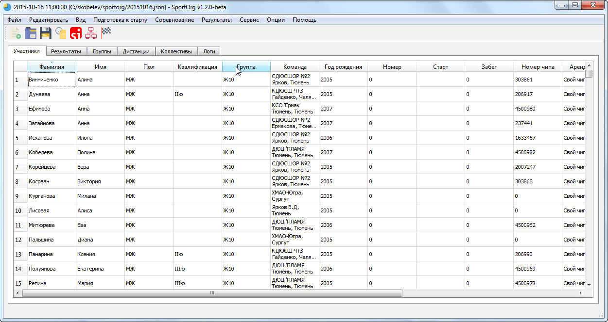

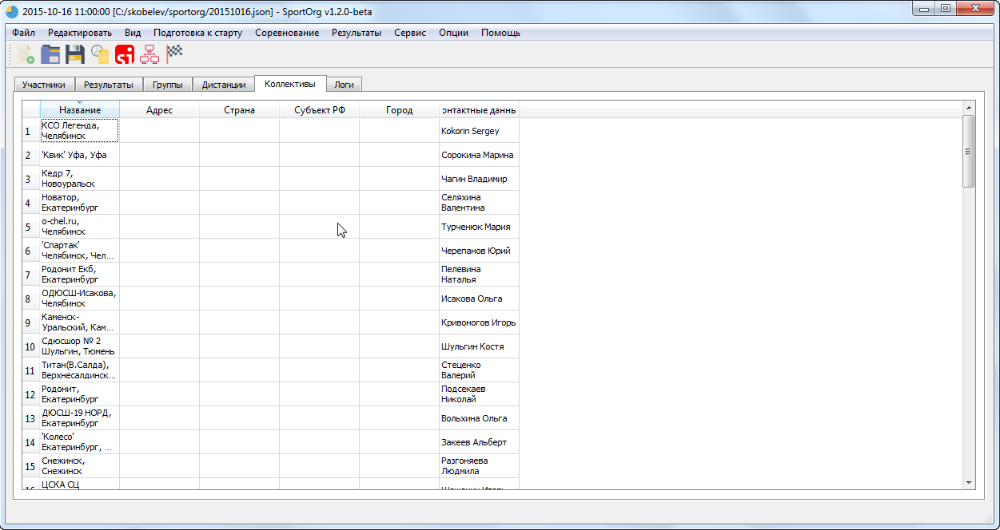

## Импортирование данных о дистанциях (OCAD Courses v8)

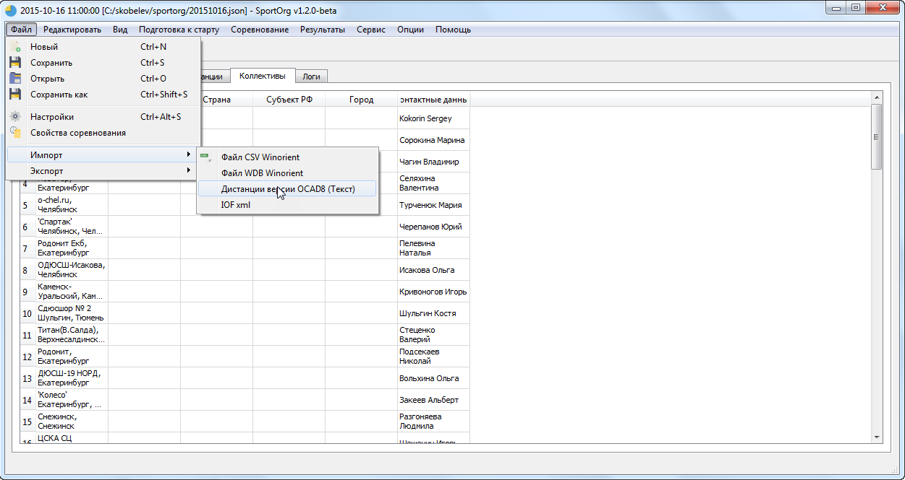

## IOF XML 3.0

`Файл -> Импорт -> IOF XML`

Поддерживается `EntryList` - список участников

## Присвоение дистанций для групп

В SportOrg есть опция подбора дистанций по имени – если имя дистанции содержит в себе имя группы, то они связываются. Например, группа “Ж12” свяжется с дистанцией “М12,Ж12”

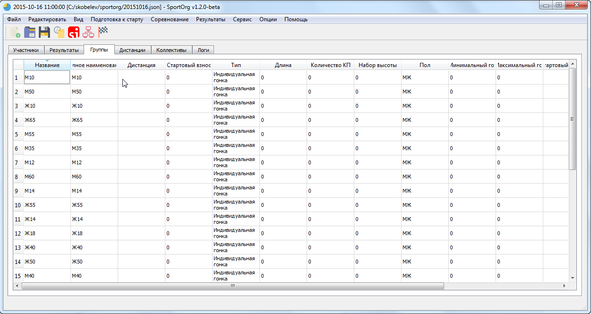
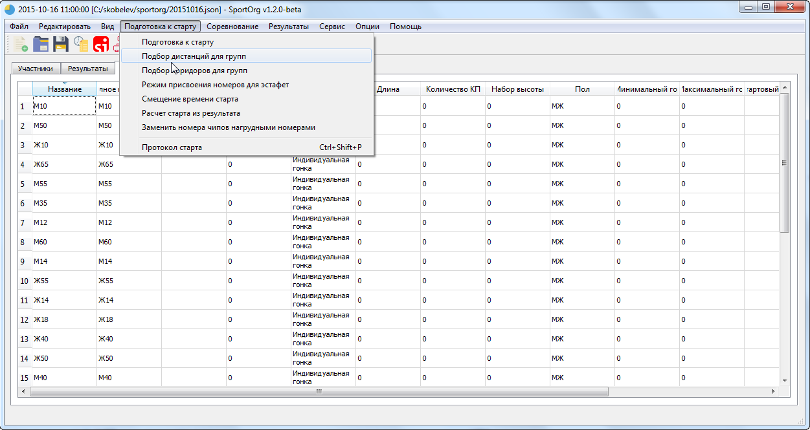

Из примера видно, что для МЭ и ЖЭ нужно указать дистанции вручную

Для редактирования группы 2 раза кликаем по ней или нажимаем Enter после выделения

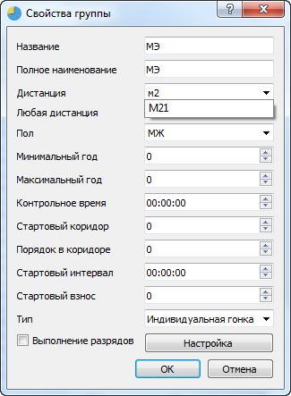

Во всех выпадающих списках применяется фильтрация по введенному значению

## Присвоение коридоров для групп

Теперь можно прописать коридоры для групп

Есть также автоматическое присвоение коридоров, но оно нам сейчас не совсем подойдет, у нас 1 группа = 1 дистанция.

Присваиваем коридоры и порядок в коридоре согласно положению о соревнованиях

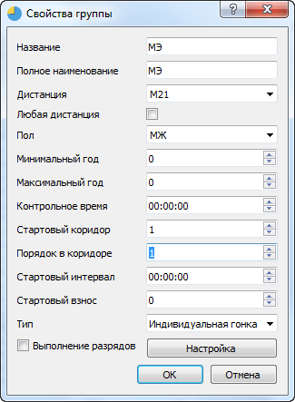
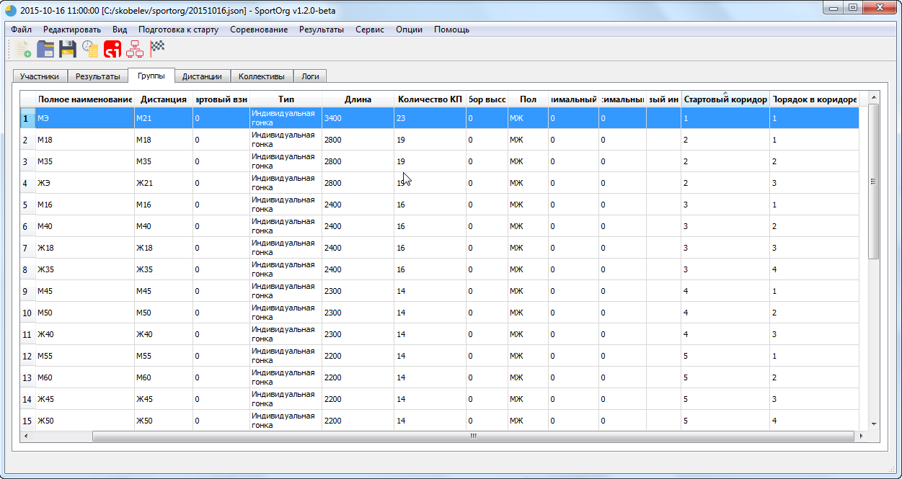

## Работа с участниками – фильтрация

Для отображения части участников, принадлежащих к одной группе или коллективу, можно использовать фильтрацию.

В текущей версии программы есть возможность фильтровать участников по группам и/или коллективам.

Для сброса фильтра необходимо установить пустые значения для поиска в диалоге фильтрации.

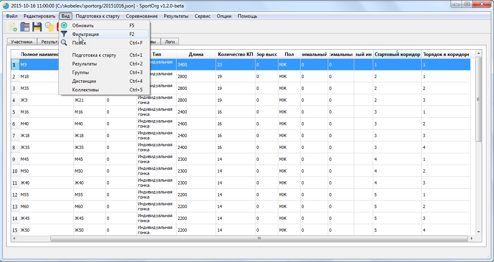
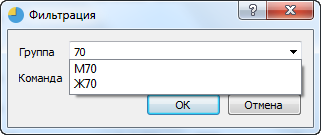
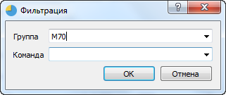
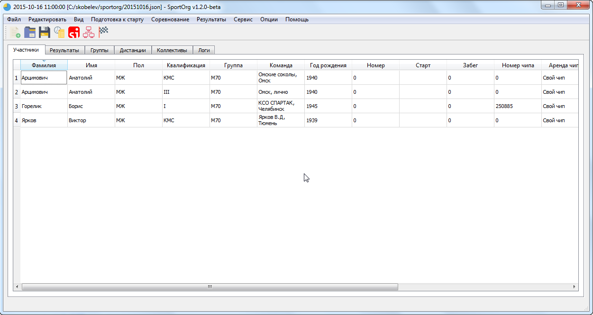
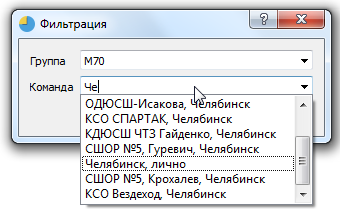
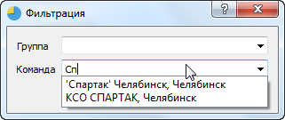
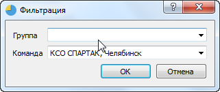
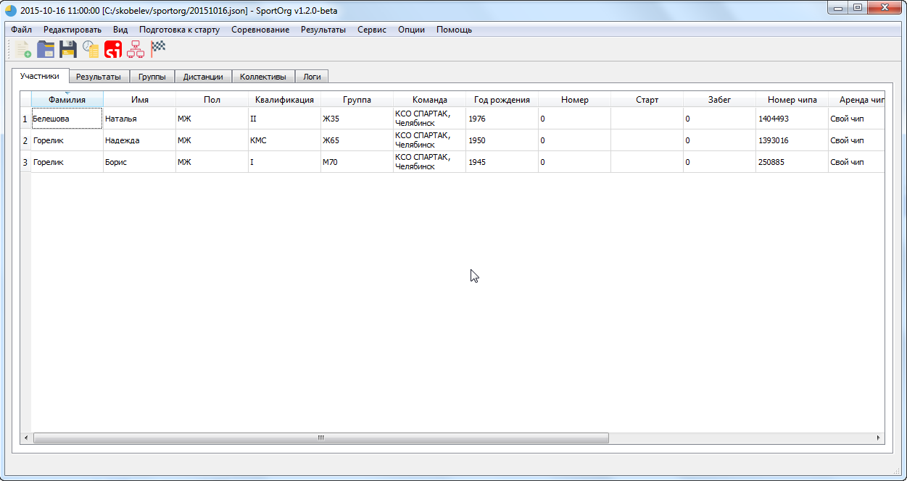
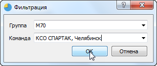
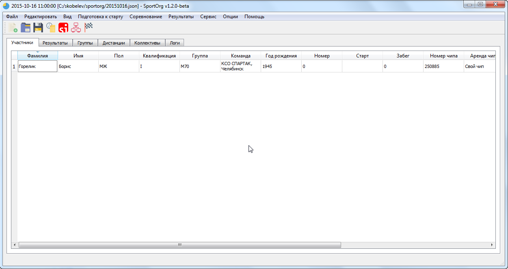