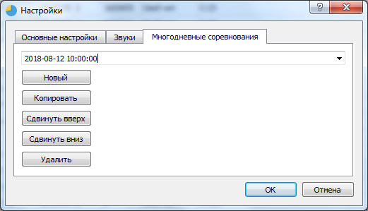
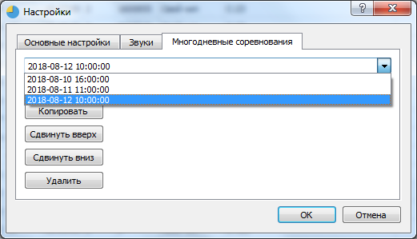
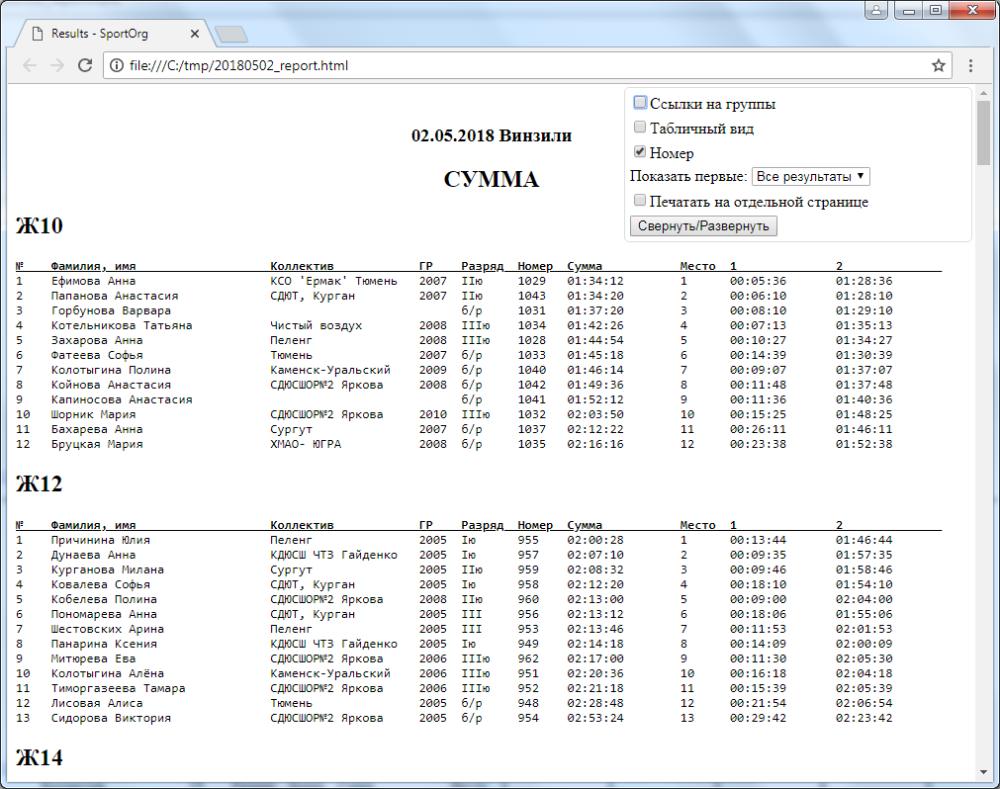

# Многодневные соревнования

___

В SportOrg есть поддержка многодневных соревнований. В одной базе сохраняется информация по нескольким стартам, есть возможность подсчета суммы по нескольким дням.

В меню Файл-Настройки есть вкладка "Многодневные соревнования". С использованием этого диалогового окна Вы можете создать несколько соревновательных дней / стартов в рамках одних соревнований (многодневные соревнования).

Принцип работы SportOrg такой, что пользователь работает всегда только с одним определенным днем/стартом. Редактирование участников, прием финиша происходят только в текущем дне. 
Все данные участников, финиш, сплиты, большинство настроек хранятся внутри соревновательного дня. 

Для переключения между соревновательными днями используется выпадающий список, каждая строчка которого соответствует отдельному дню, показывается время старта для этого дня, взятое из его настроек.
Для перехода на другой соревновательный день просто выберете из списка нужное значение.

## основные операции с днями

* `Новый` Создание нового соревновательного дня. День помещается в конец списка.
* `Копировать` Копирование текущего соревновательного дня в новый. Новый день помещается в конец списка.
* `Сдвинуть вверх` Текущий соревновательный день перемещается выше по списку.
* `Сдвинуть вниз` Текущий соревновательный день перемещается ниже по списку.
* `Удалить` Текущий соревновательный день полностью удаляется. Будьте внимательны, удаление производится безвозвратно! Рекомендуем сделать резервную копию базы перед удалением.

## шаблон для расчета суммы

Для расчета суммы выберете шаблон `4_sum_times.html` при создании протокола.

Будет сгенерирован протокол результатов. 

> При подсчете суммы в текущей версии 1.4 данные объединяются по номеру участника, в дальнейшем планируется сделать также поддержку объединения результатов по имени участника и группе, независимо от номера. 
