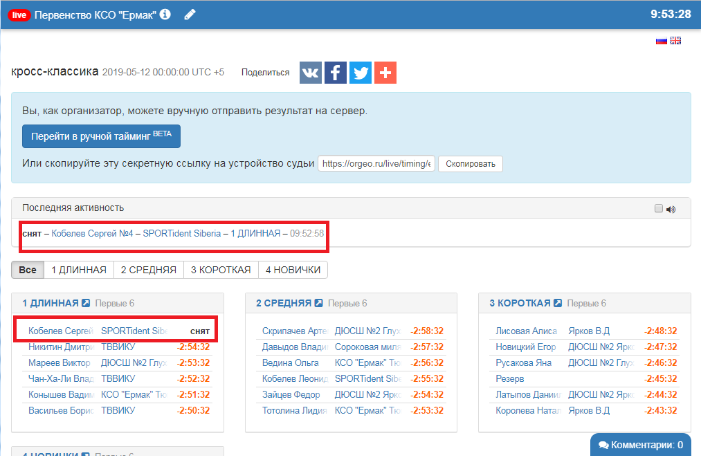

# Онлайн (orgeo.ru)

Orgeo.ru – сервис для организации спортивных мероприятий. Организаторы добавляют события, а тренеры и спортсмены – следят за календарем соревнований и заявляются на участие, командно или лично. 
При помощи системы Orgeo.ru, организатор может сделать онлайн трансляцию результатов.

##Настройки на Orgeo.ru и в SportOrg

В первую очередь, создайте мероприятие в системе Orgeo.ru. Не забудьте проставить галочки «Старт» напротив дней мероприятия. Вы также можете предварительно собрать заявки через систему Оргео, но это не обязательно.

Онлайн трансляция настраивается на форме редактирования соревнований:

Окно настройки прямой трансляции финиша

Чтобы активировать онлайн-трансляцию результатов, необходимо:

На странице редактирования соревнования, включить галочку «Онлайн трансляция результатов с финиша»

Установить правильную временную зону (разницу в часах от среднеевропейского времени в часах — для Москвы это 5)

Скопировать в поле «URL» адрес URL из ячейки напротив нужного старта (дня соревнований) из Оргео и поставить галочку «Включить».

Загрузить стратовый протокол. Выбрать нужных участников или группы и выполнить пункт меню **Сервис > Командная работа > Отправить выбранные** (Ctrl + K)

Данные отсылаются автоматически при каждом считывании чипа или изменении результата. При этом в логе пишется статус отправки данных на сервер.

Обязательно протестируйте трансляцию заранее перед стартом. Для этого можно передать отметку снятого или не стартовавшего участника (DNS) и проконтролировать, что всё отображается на странице трансляции, то есть https://orgeo.ru/live/#/ID_вашего_соревнования

Замечание. При удалении результатов они также удаляются с сервера orgeo.ru. Обязательно отключайте онлайн-передачу после завершения соревнований, чтобы случайно не удалить данные с orgeo.ru.
Замечание. Иногда при нестабильном Интернете часть результатов могут быть не переденными на сервер. Рекомендуется выделять все результаты и отправлять их на сервер повторно (Ctrl+A, Ctrl+K).
