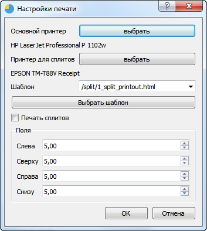
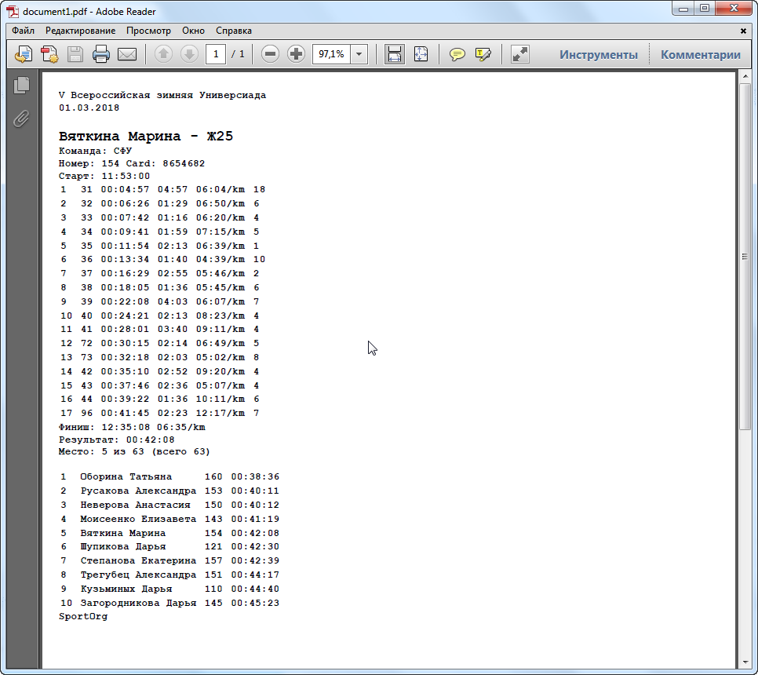

## Печать распечаток

При печати распечаток используется стандартный шаблон для печати.

Также предварительно необходимо задать принтер для печати распечаток. Это можно сделать в диалоге "Настройки печати".



---
###Важное замечание!
В пути до исполняемого файла приложения SportOrg должны содержаться только английские символы! Без этого система печати, к сожалению, не работает - диалог выбора принтера не будет появляться.

---

Установите галочку "Печать сплитов" для автоматической печати распечаток после считывания нового чипа.

Для печати сплитов вручную выделите в таблице результатов одну или несколько строк и используйте меню «Результаты – Печать сплитов». Будут напечатаны сплиты выбранных участников.  
Также можно использовать горячую клавишу **CTRL+L**.





Дизайн шаблона можно изменять по вашему усмотрению, используя формат HTML.
Например, для добавления произвольного изображения в конце распечатки можно дописать блок **img** в конце шаблона:

```
...
<br> {{ race.data.url }}
</code>

</body>
</html>
```

Изображение должно располагаться по следующему пути: C:\Program Files (x86)\SportOrg\templates\split\img.png. Не забывайте переносить его на другой компьютер, если вы работаете на нескольких компьютерах.
Обязательно заблаговременно проверьте, как печатаются сплиты на том принтере, который будет использоваться во время соревнований!


