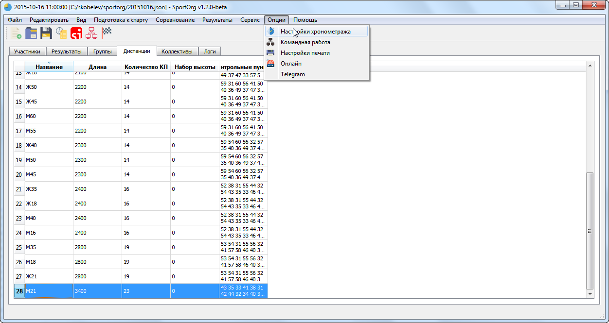
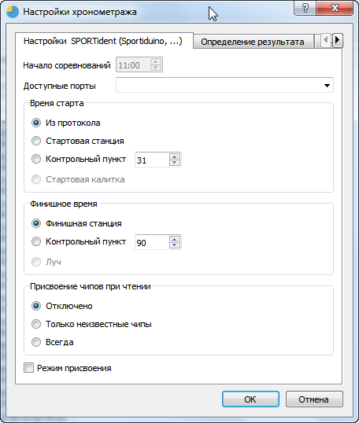
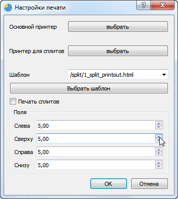
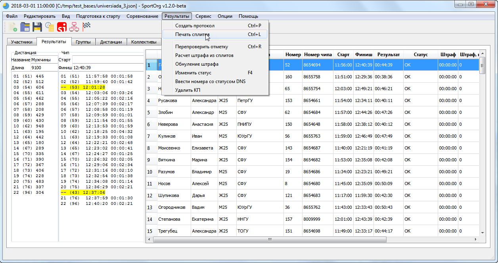
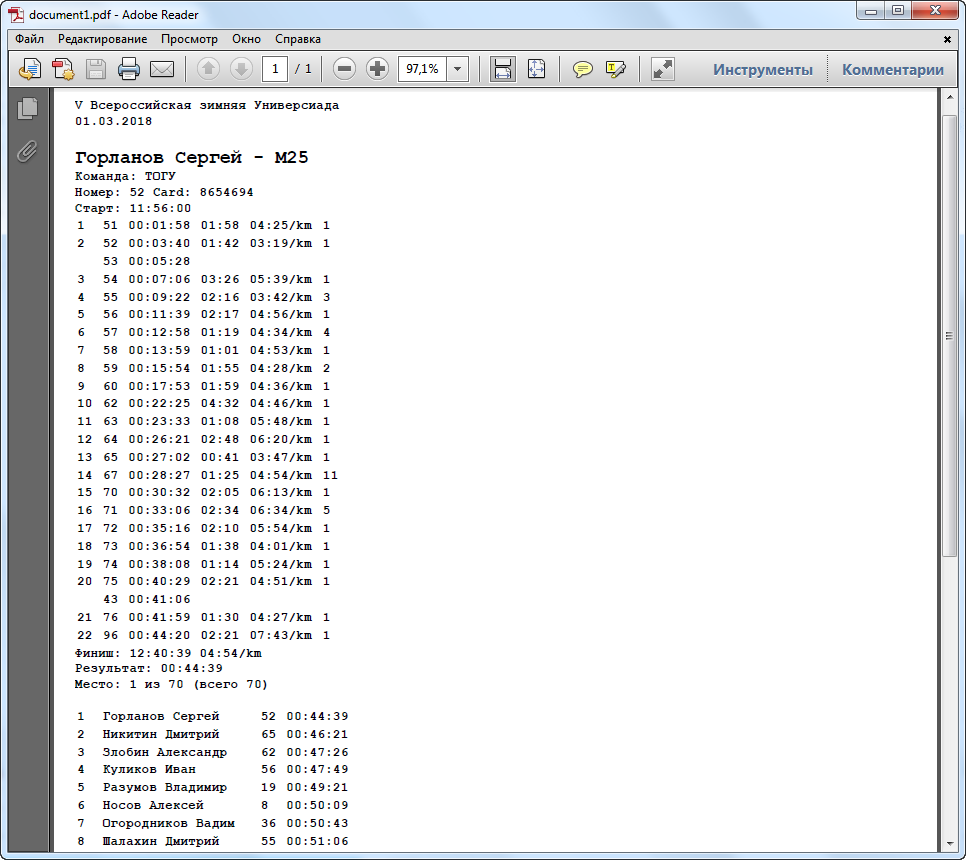

# Работа с электронной отметкой SPORTident

___

Для активации чтения чипов необходимо подключить мастер-станцию SOPRTident к компьютеру и нажать на иконку SPORTident на панели инструментов. Для работы станция должна быть в режиме чтения чипов, должен быть отключен режим совместимости (Legacy protocol).

При чтении чипов данные будут появляться на вкладке результаты.
Если чип не зарегистрирован в базе, в результатах будет строка без ФИО участника. Можно отредактировать ее, присвоив номер участника, после этого отметка будет перепроверена.

Также можно изменить номер участника, если ему присвоен неправильный чип. Все результаты при этом будут пересчитаны автоматически.

[Проверка отметки](course.md)

## Настройка SPORTident

Задаются источники для стартового и финишного времени – это могут быть специальные станции старт/финиша, станции КП с заданным номером, значение старта из базы данных, время,
полученное от стартовой калитки либо финишного луча.

Также устанавливается время начала соревнований – это нужно для работы с чипами SI5, записывающими время в 12-часовом формате.

## Печать распечаток

При печати распечаток будет использоваться стандартный шаблон для печати.

Также предварительно необходимо задать принтер по умолчанию для печати распечаток. Это можно сделать в диалоги настройки печати.

Для печати сплитов используйте меню «Результаты – Печать сплитов». На выбранный принтер будут выведены сплиты текущего участника

