# Подготовка к старту

___

## Добавление резервных участников

При проведении крупных соревнований нередки ситуации, когда на старт приезжают
незарегистрированные участники. Если для дисциплин с общим стартом это не так критично, важно только, чтобы были карты в наличии, то для стартов с индивидуальным стартом нужно
заранее побеспокоиться о резервных участниках. Например, ветераны по группе М60, пусть даже они забыли заявиться, предпочли бы стартовать вместе со своей группой, а не с женщинами в
конце протокола.

Для вставки резервных участников отметьте пункт «Добавлять резервы» в окне «Подготовка к старту».

Опции:

* Имя для резервных участников – Вы можете задать имя для участников, которые будут автоматически добавлены. Добавленные ранее резервные участники будут учитываться при добавлении новых, поиск будет производиться по этому имени.
* Количество резервов на группу, шт. – точное количество участников, вставляемое в каждую группу
* Количество резервов на группу, % - количество участников, вставляемое в каждую группу, рассчитанное как процент от общего количества участников в группе.

Например, при 35 участниках в группе и указании 10% будут добавлены 4 участника.

При одновременном использовании двух опций вставки (проценты и точное количество) ищется и используется максимальное значение.

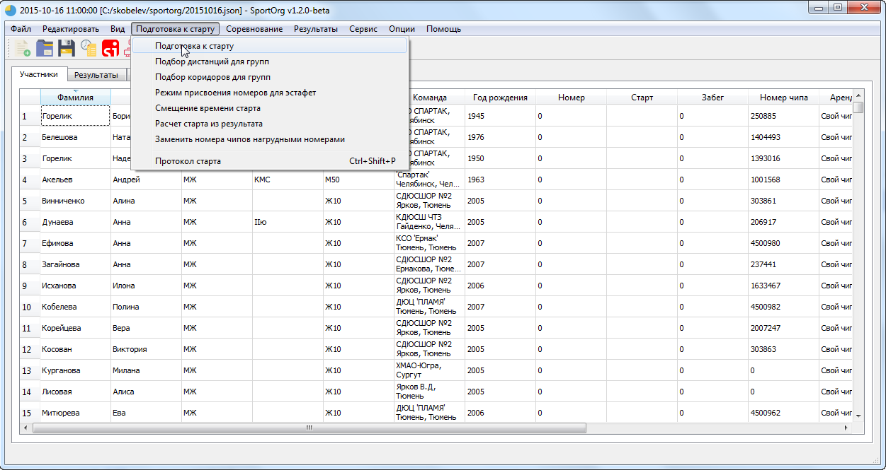
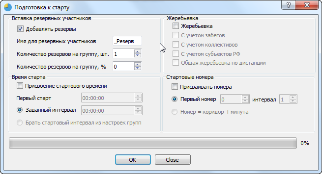

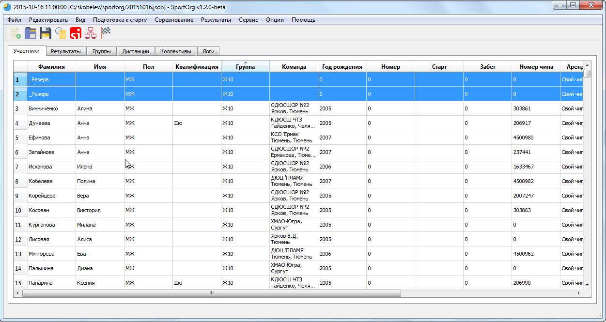
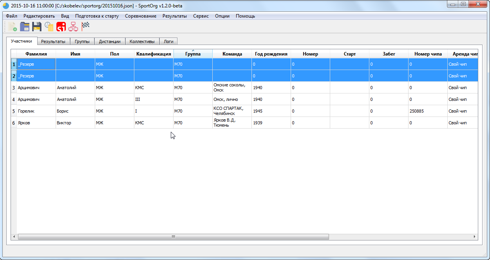

## Жеребьевка

Необходимо провести жеребьевку - выстроить спортсменов в случайном порядке.

Во многих видах спорта с индивидуальным стартом, в том числе в лыжных гонках и в ориентировании стартовая позиция может давать преимущество, поэтому нередко применяют компьютерную жеребьевку.

Для проведения жеребьевки отметьте пункт «Жеребьевка» в окне «Подготовка к старту».

Жеребьевка проводится во всех группах одновременно для текущих спортсменов.

Если необходимо выполнить частичную жеребьевку участников, предварительно задайте фильтр.
Опции жеребьевки:

* С учетом забегов. Участники делятся на забеги, внутри которых происходит жеребьевка. Быстрый ввод забега осуществляется набором номера на клавиатуре с зажатой клавишей Alt, при этом должна быть активна соответствующая строка в таблице. Например, для ввода 1 забега нужно выделить строку с нужным участником и нажать “Alt + 1”.
* С учетом коллективов. Существует одно ограничение - 2 спортсмена одной команды не должны идти подряд, это уменьшает вероятность их сотрудничества на дистанции и делает гонку более интересной. Цитата из правил: «В лично-командных соревнованиях, в том числе квалификационных, жеребьевка должна быть проведена таким образом, чтобы участники одной команды не получили рядом стоящих стартовых номеров». Если провести жеребьевку с учетом коллективов невозможно, она все равно проводится без учета этой опции.
* С учетом регионов. Жеребьевка проводится аналогично опции «С учетом коллективов», но вместо групп используются регионы, к которым привязаны группы (Например, субъекты РФ).
* Общая жеребьевка по дистанции. По умолчанию жеребьевка осуществляется внутри 1 группы, но если использовать эту опцию, то группы, относящиеся к одной дистанции, будут перемешаны между собой.

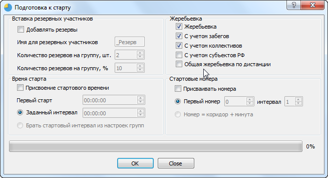

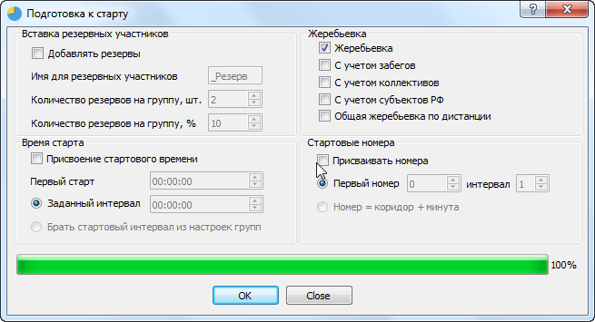

## Присвоение стартового времени

Применяется при необходимости присвоить стартовое время участникам.
При наличии фильтрации обрабатываются только отфильтрованные записи. Обработка производится по коридорам – сначала обрабатывается первый коридор, затем второй и т.д. При переходе к новому коридору берется начальное время старта.

Для проведения присвоения стартового времени отметьте пункт «Присвоение стартового времени» в окне «Подготовка к старту».

Опции:

* Первый старт – время старта первого в коридоре участника.
* Заданный интервал – стартовый интервал, одинаковый для всех групп
* Брать стартовый интервал из настроек групп – при активации этой настройки для каждой группы может быть использован произвольный интервал старта, который задается в свойствах группы.

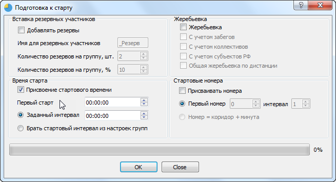

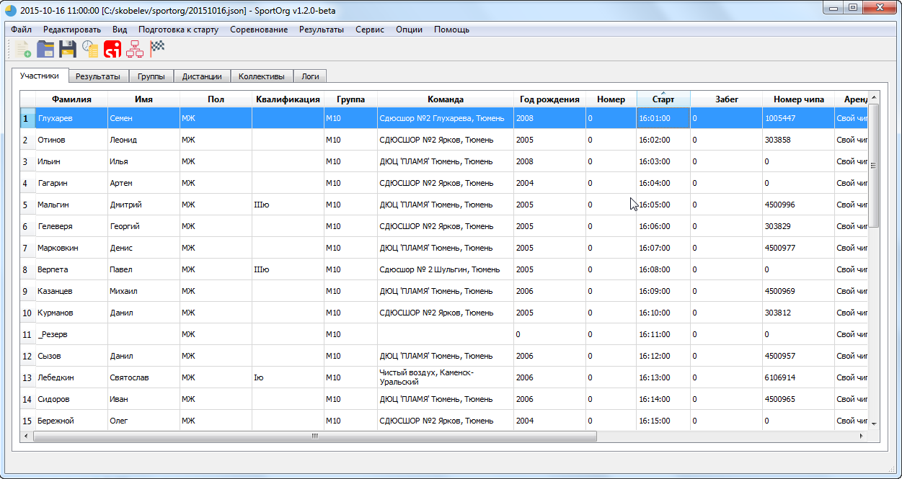

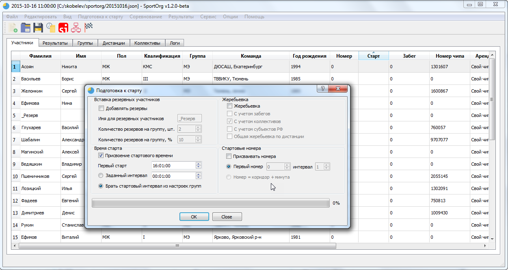

## Присвоение стартовых номеров

Применяется при необходимости присвоить стартовые номера участникам.

Для присвоения стартовых номеров отметьте пункт «Присваивать номера» в окне «Подготовка к старту».

Опции:

* Первый номер – первый стартовый номер для присвоения
* Интервал – интервал присвоения стартовых номеров
* Номер = коридор + минута – данная опция используется для задания номеров, в которых 2 последних цифры совпадают со стартовой минутой, а первая начальная цифра (цифры) служат для идентификации коридора. Номера присваиваются по стартовым коридорам, при переходе к новому коридору цифра сотен увеличивается на 1.

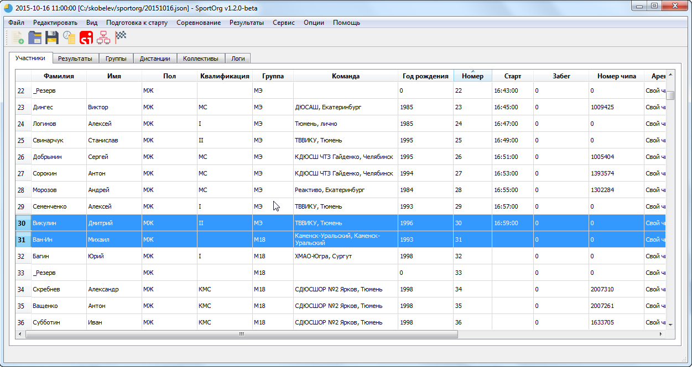
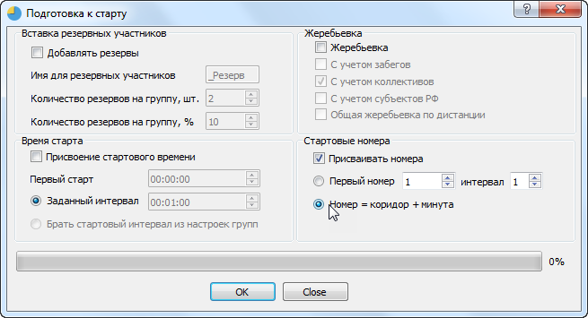
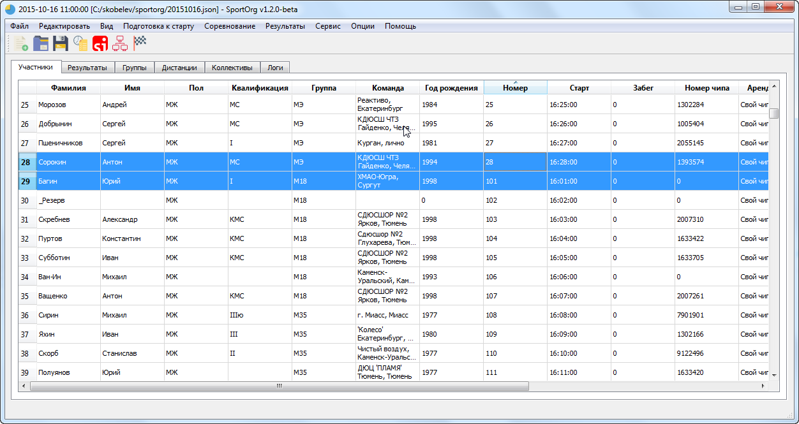
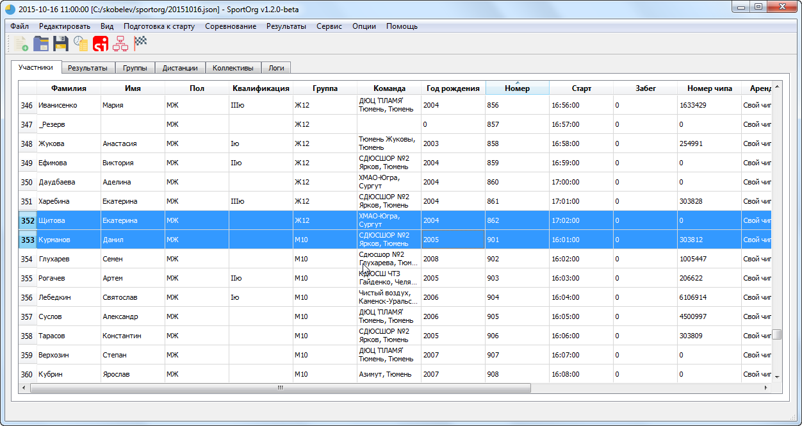

## Общая подготовка старта для примера

Все операции – жеребьевка, присвоение стартового времени, номеров, вставка резервных участников, выполняются одновременно для всех участников во всех группах. Предварительно необходимо только распределить группы по коридорам.

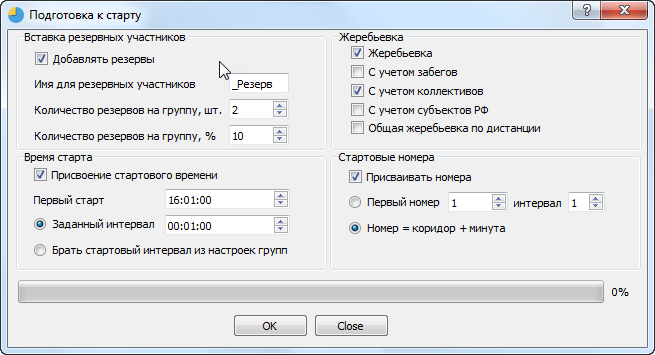
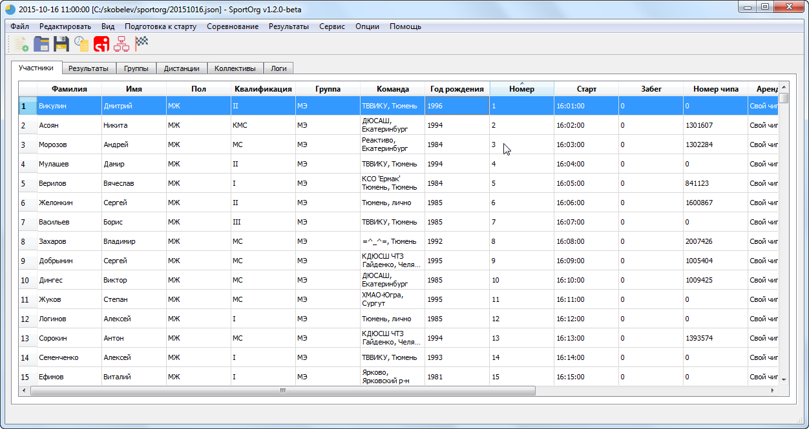

## Создание протокола старта

Вы можете выбрать один из предустановленных шаблонов либо настроить свой собственный (Шаблонизатор Jinja2, только для продвинутых пользователей). В большинстве случаев хватает функционала стандартных шаблонов.

Протокол будет открыт в новом окне.

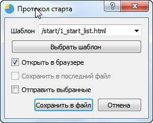

## Шахматка

Используйте шаблон `times` в диалоге "Протокол старта"

Данная опция позволяет вывести список номеров спортсменов, отсортированный по минутам.

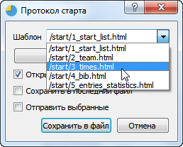
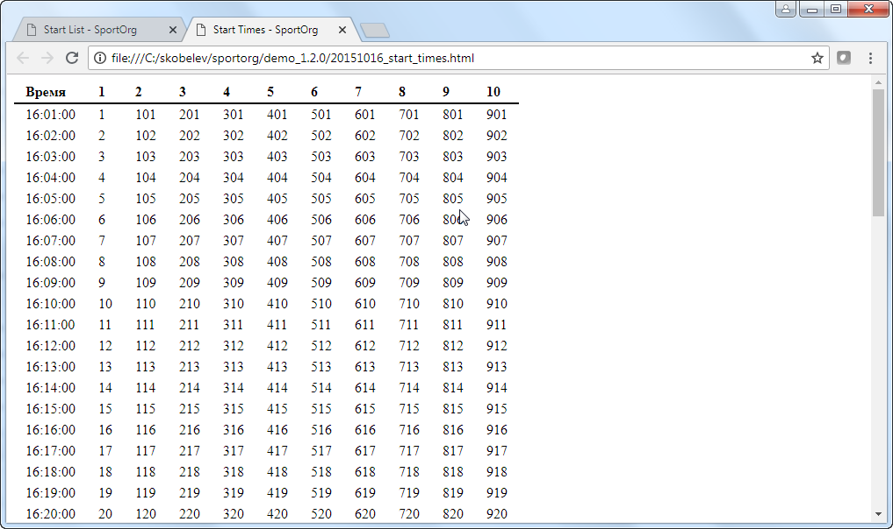

Есть возможность скопировать текст в буфер обмена для последующего редактирования и распечатки в Word или Excel.

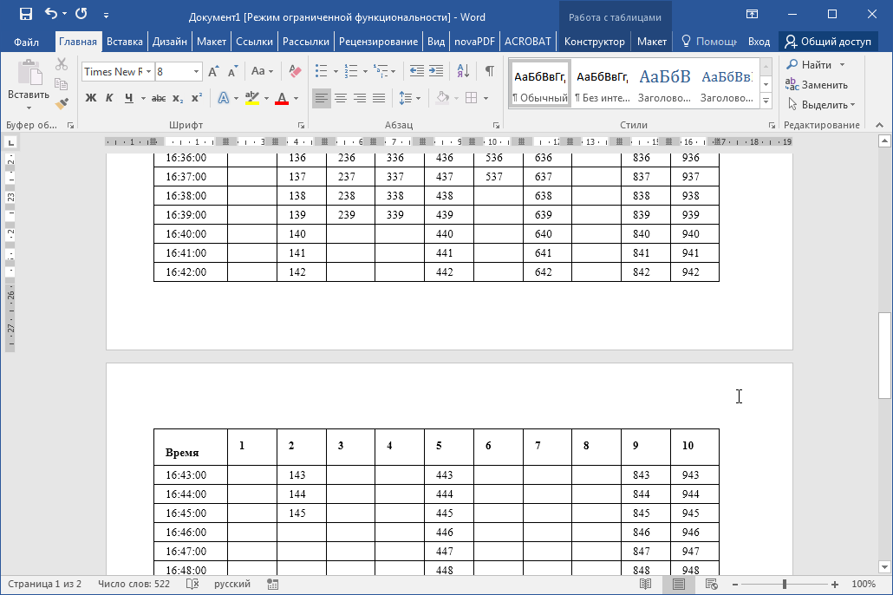

## Списки участников по коллективам (выписки)

Используйте шаблон `team` в диалоге "Протокол старта"

Будут сформированы списки участников, сгруппированные по коллективу. 

Непосредственно в самом отчете можно настроить сортировку участников, отображение стартового взноса. Есть возможность 
отключить разбиение списка по коллективам. 

Также этот отчет применяется для печати списка выделенных участников. При этом выводится общая сумма стартовых взносов. 

## Печать номеров участников

Используйте шаблон `bib` в диалоге "Протокол старта"

Будут сформированы номера участников, расположенные по 4шт. на лист при печати. Рекомендуется использовать браузер 
Google Chrome версии 60 и выше.
Непосредственно в самом отчете можно настроить сортировку участников

## Протокол комиссии по допуску

Используйте шаблон `entries_statistics` в диалоге "Протокол старта"

Будет сформирован протокол, содержащий информацию о коллективах, а также информацию о квалификации участников.

