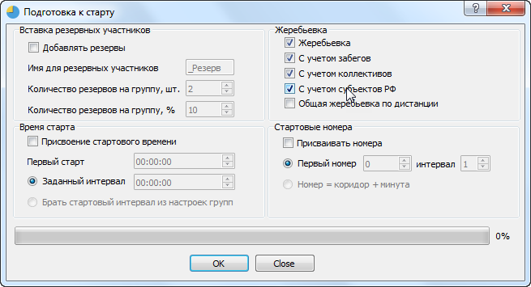
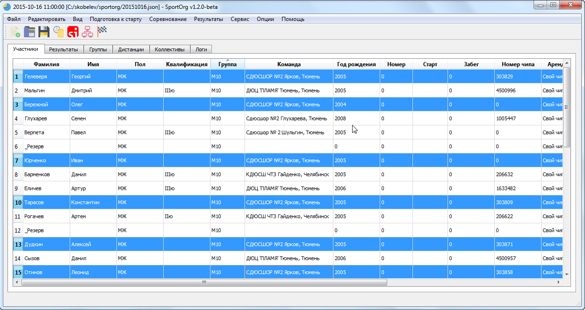
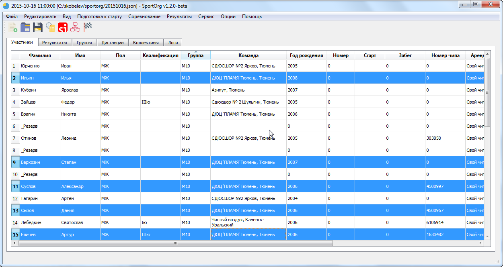
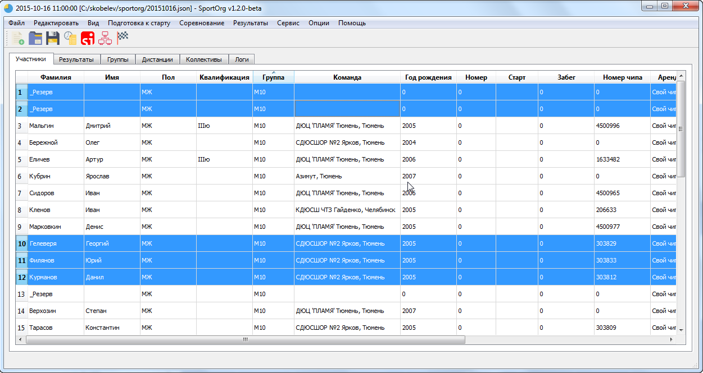

# Жеребьевка

Часто необходимо провести жеребьевку - выстроить спортсменов в случайном порядке.

Во многих видах спорта с индивидуальным стартом, в том числе в лыжных гонках и в ориентировании стартовая позиция может давать преимущество, поэтому нередко применяют компьютерную жеребьевку.

Для проведения жеребьевки отметьте пункт «Жеребьевка» в окне «Подготовка к старту».

Жеребьевка проводится во всех группах одновременно для текущих спортсменов.

Если необходимо выполнить частичную жеребьевку участников, предварительно задайте фильтр.
Опции жеребьевки:

* С учетом забегов. Участники делятся на забеги, внутри которых происходит жеребьевка. Быстрый ввод забега осуществляется набором номера на клавиатуре с зажатой клавишей Alt, при этом должна быть активна соответствующая строка в таблице. Например, для ввода 1 забега нужно выделить строку с нужным участником и нажать “Alt + 1”.
* С учетом коллективов. Существует одно ограничение - 2 спортсмена одной команды не должны идти подряд, это уменьшает вероятность их сотрудничества на дистанции и делает гонку более интересной. Цитата из правил: «В лично-командных соревнованиях, в том числе квалификационных, жеребьевка должна быть проведена таким образом, чтобы участники одной команды не получили рядом стоящих стартовых номеров». Если провести жеребьевку с учетом коллективов невозможно, она все равно проводится без учета этой опции.
* С учетом регионов. Жеребьевка проводится аналогично опции «С учетом коллективов», но вместо групп используются регионы, к которым привязаны группы (Например, субъекты РФ).
* Общая жеребьевка по дистанции. По умолчанию жеребьевка осуществляется внутри 1 группы, но если использовать эту опцию, то группы, относящиеся к одной дистанции, будут перемешаны между собой.

