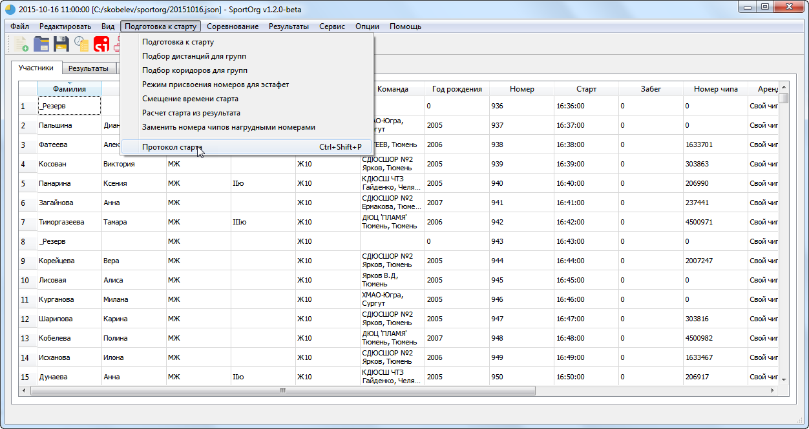

# Создание протокола старта

Вы можете выбрать один из предустановленных шаблонов либо настроить свой собственный (Шаблонизатор Jinja2, только для продвинутых пользователей). В большинстве случаев хватает функционала стандартных шаблонов.

Протокол будет открыт в новом окне.

