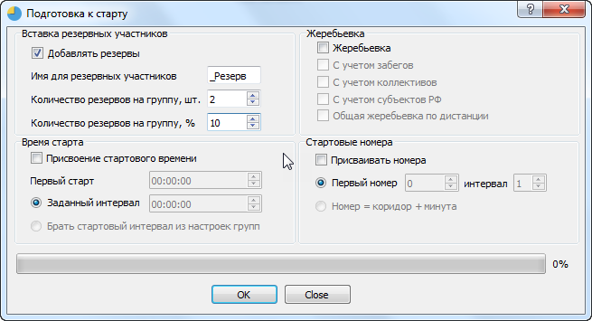

# Добавление резервных участников

При проведении крупных соревнований нередки ситуации, когда на старт приезжают
незарегистрированные участники. Если для дисциплин с общим стартом это не так критично, важно только, чтобы были карты в наличии, то для стартов с индивидуальным стартом нужно
заранее побеспокоиться о резервных участниках. Например, ветераны по группе М60, пусть даже они забыли заявиться, предпочли бы стартовать вместе со своей группой, а не с женщинами в
конце протокола.

Для вставки резервных участников отметьте пункт «Добавлять резервы» в окне «Подготовка к старту».

Опции:

* Имя для резервных участников – Вы можете задать имя для участников, которые будут автоматически добавлены. Добавленные ранее резервные участники будут учитываться при добавлении новых, поиск будет производиться по этому имени.
* Количество резервов на группу, шт. – точное количество участников, вставляемое в каждую группу
* Количество резервов на группу, % - количество участников, вставляемое в каждую группу, рассчитанное как процент от общего количества участников в группе.

Например, при 35 участниках в группе и указании 10% будут добавлены 4 участника.

При одновременном использовании двух опций вставки (проценты и точное количество) ищется и используется максимальное значение.

