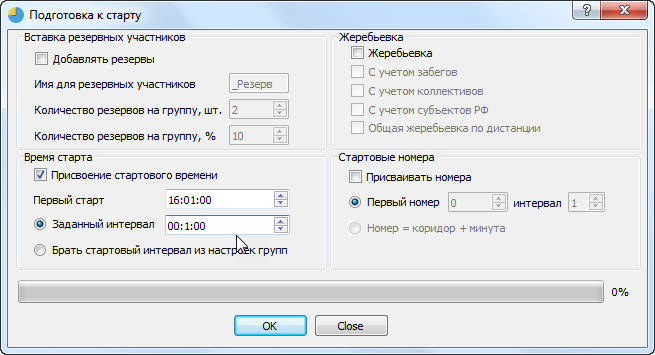
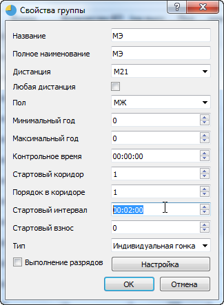
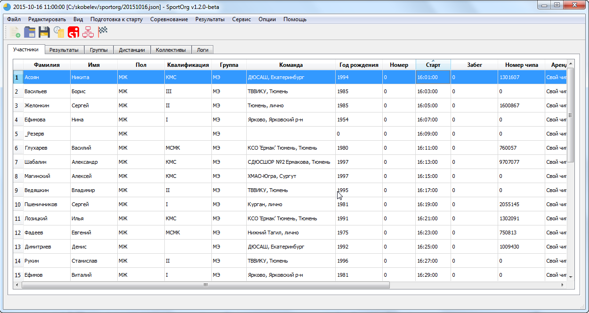

# Присвоение стартового времени

Применяется при необходимости присвоить стартовое время участникам.
При наличии фильтрации обрабатываются только отфильтрованные записи. Обработка производится по коридорам – сначала обрабатывается первый коридор, затем второй и т.д. При переходе к новому коридору берется начальное время старта.

Для проведения присвоения стартового времени отметьте пункт «Присвоение стартового времени» в окне «Подготовка к старту».

Опции:

* Первый старт – время старта первого в коридоре участника.
* Заданный интервал – стартовый интервал, одинаковый для всех групп
* Брать стартовый интервал из настроек групп – при активации этой настройки для каждой группы может быть использован произвольный интервал старта, который задается в свойствах группы.

