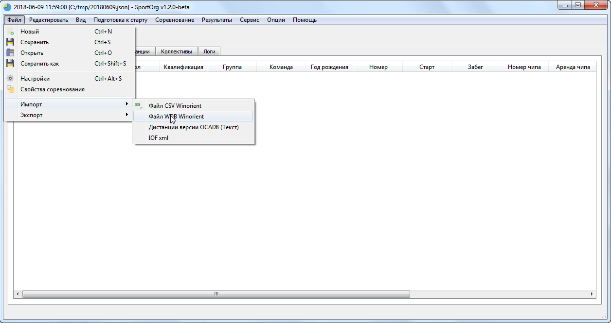
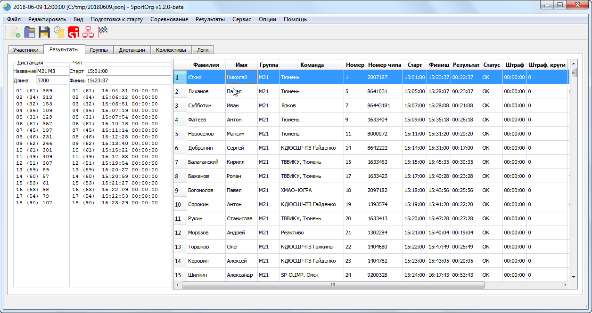

# Winorient

___

## Поддержка формата WDB (Winorient)

SportOrg позволяет сохранить и загрузить данные из формата WDB (Winorient).

Поддерживаются основные объекты – участники, группы, коллективы, результаты, данные чипов.

